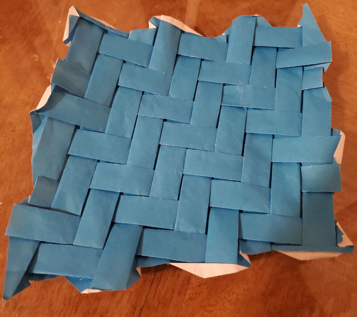
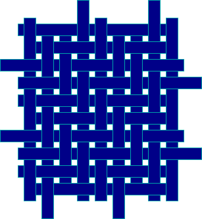
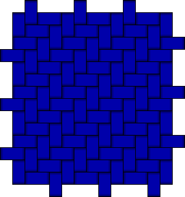
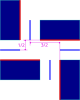
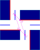
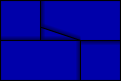
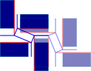
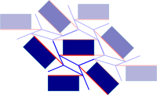
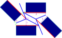
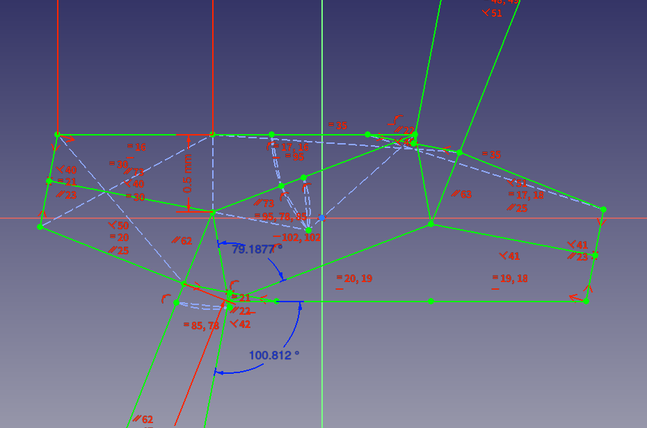

    <figure>
        
    </figure>
    <figure>
          
    </figure>

Plain weaves (each strip alternates going over and under cross strips) in origami have been done for a while.
Some are simple, such as the well-known square weave. Some are more complicated,
like [Courteous Anarchy by Robert Lang](https://langorigami.com/artwork/courteous-anarchy-opus-651/) (still a plain weave!)

    <figure>
          
        <figcaption> A closed square weave with a pleat width of half the strip width</figcaption>
    </figure>

However, there's other types of weaves. Like the (2,2)-twill (each strip goes over 2 cross strips and under 2 cross strips, and adjacent strips have their over-unders offset by 1).
So I challenged myself to make one. I'll be making a *closed* (2,2)-twill, because it looks cool[^open]

    <figure>
        
        <figcaption>A(n open) (2,2)-twill, for reference</figcaption>
    </figure>
    <figure>
        
        <figcaption>A closed (2,2)-twill. This is what I'm targeting.</figcaption>
    </figure>

# Setting Up the Pleat Shift
First, we lay out the rectangles, and add pleats so the rectangles are set to go to their target positions. Aiming for a pleat width of half the width (short side) of a rectangle, if we
call the strip width 1 (and thus the pleat width 1/2),
we want to shift a pleat by 1/2 and its perpendicular pleat by 3/2, while twisting them (a blog post about pleat shifting is coming soon...)

    <figure>
        
        <figcaption>The pleat setup for the (2,2)-twill. Note how much the pleats are shifted by, and that they're twisted.</figcaption>
    </figure>
    

    <figure>
        
        <figcaption>Some labelling done on the pleat shift. Quadrilateral $$ABCD$$ is critical; no creases can cross it.</figcaption>
    </figure>

Looking at the above figure, note that no creases can cross the rectangles, as they will show. The closest point $$A$$
can get to point $$B$$ is a vertical distance of 3/2, making $$\overline{AB}$$ *critical*:
the distance between them in the crease pattern is the distance between them in the final folding, so no
creases can cross $$\overline{AB}$$. Similarly, $$\overline{CD}$$ is critical. Note that $$\overline{BC}$$ and $$\overline{DA}$$ are critical by virtue of being adjacent, so
the entire quadrilateral becomes a no-crease zone. With that in mind, let's try constructing this twist and see what happens!

    <figure>
          
        <figcaption>The twist. Unfortunately...</figcaption>
    </figure>
    <figure>
        
        <figcaption>it doesn't quite work due to a pesky little triangle.</figcaption>
    </figure>

Ugh, that stings. We can try moving $$A$$ farther away from $$B$$ and seeing if we can fix the overlapping problem. But at the time, I didn't realize this and gave up
on this problem for a good while.[^farther]

# Rotation to the Rescue

I decided that every twist needed to be a pure quadrilateral twist, with no creases crossing it. It *is* possible to do this with just one unit, by bringing some rectangles
closer together. However, this won't tile.

    <figure>
          
        <figcaption>A pure quadrilateral twist that gives the intended folded state</figcaption>
    </figure>
    <figure>
        
        <figcaption>But it doesn't tile. Pleats of different widths want to match up.</figcaption>
    </figure>

So how do we solve this? We can try *rotating* some of the tiles, turning the pleats into angled crimps. This would look something like this:

    <figure>
        
        <figcaption>Like this. And it tiles. (Yes, I over-rotated the tiles, but we'll get into that)</figcaption>
    </figure>
    <figure>
        
        <figcaption>A single "repeating unit" labelled with important values.</figcaption>
    </figure>

The "repeating unit" has 180° rotational symmetry. For it to tile, the lengths of the green line segments must equal. We'll call that value $$x$$.
We fix the crimp "width" $$h$$ so it's constant, since this is a parameter we have. For the unit to fold flat,
the four vertices in the twist must satisfy Kawasaki's theroem, so $$\alpha + \beta = \gamma + \delta = 180^\circ$$. When $$\theta = 45^\circ$$, as shown in the diagram,
$$\alpha + \beta > 180^\circ$$ and $$\gamma + \delta < 180^\circ$$. When $$\theta = 0^\circ$$ (no rotation), then the inequalities flip. By the intermediate value theorem,
there's a value for $$\theta$$ where $$\alpha + \beta = 180^\circ$$. Due to the symmetries of the unit, we know that $$\beta + \delta = 180^\circ$$ and $$\alpha + \gamma = 180^\circ$$
regardless of $$\theta$$. Thus, when $$\alpha + \beta = 180^\circ$$, we also have $$\gamma + \delta = 180^\circ$$, satisfying the condition. Now we just have to find
$$\theta$$.

So I ran FreeCAD (a constraint solver, among other things) to find this value, which ended up being about 79.187683036437065°[^precision], and then used Oriedita
to construct the tessellation, which worked (resulting in the crease pattern at the top).

    <figure>
        
        <figcaption>The sketch made in FreeCAD. The boundary is a little different than described, but it still works.
            <a href="2-2-aya-ori.FCStd">Here is the FreeCAD file</a></figcaption>
    </figure>

But what's the exact value? Well, it turns out that when looking for the exact value, I realized that given $$x$$, we can derive the whole "repeating unit" without needing $$\theta$$,
so we'll be discussing the exact value of $$x$$ instead. I used Maxima because the equations get complicated, turning into a degree-10 polynomial on $$x$$. Which can thankfully
be factored into quadratics. The result is that $$x$$ satisfies:

$$(x+2)^2\cdot(x^2-hx+h^2+1)\cdot(x^2-hx-h)\cdot(x^2+(-h+1)x-2h)\cdot((2h+1)x^2+(-2h^2+h+1)x-2h^2)=0$$

We can set $$h = \frac{1}{2}$$, a nice value for it to be, we have:

$$(x+2)^2\cdot\left(x^2-x+\frac{5}{4}\right)\cdot\left(x^2-\frac{x}{2}-\frac{1}{2}\right)\cdot\left(x^2+\frac{x}{2}-1\right)\cdot\left(2x^2+x-\frac{1}{2}\right) = 0$$

Solving this, we get:

$$x = \left\{-2, \frac{1}{2}\pm i, -\frac{1}{2}, 1, \frac{-1\pm\sqrt{17}}{4}, \frac{-1\pm\sqrt{5}}{4}\right\}$$

Well, that's a lot of solutions. Let's see. Like half of these are negative and thus invalid. The non-real-number solutions are also invalid. Then, note that $$h$$ is the crimp
"width", so $$x > h$$ doesn't make sense. This leaves us with just $$x = \frac{-1+\sqrt{5}}{4}$$. Wait, hold up, $$\cos\left(\frac{1}{5}\tau\right)$$?
Also known as $$\frac{1}{2\varphi}$$? Interesting.
But probably doesn't really mean anything, especially when, since all coordinates happen to be $$a + b\sqrt{5}$$ where $$a$$ and $$b$$ are rational numbers,
$$\sin\left(\frac{1}{5}\tau\right)$$ can't show up.

# The ($$k$$, $$k$$)-Twill

We can generalize this to the ($$k$$, $$k$$)-twill, where each strip goes over $$k$$ strips and under $$k$$ strips. In this case, our rectangles are $$k$$ long
(instead of 2 long), and the equation for $$x$$ becomes (this time removing bad quadratics):

$$(2h+1)x^2 + (hk + k - 2h^2 - h - 1)x - h^2k = 0$$

And when $$h = \frac{1}{2}$$, we get:

$$2x^2 + \frac{3k - 4}{2}x - \frac{k}{4}$$

resulting in (omitting the negative solution)

$$x = \frac{-3n + 4 + \sqrt{9n^2 - 16n + 16}}{8}$$

We can make a table of the first few values (remember, $$h = \frac{1}{2}$$).

| $$k$$ | $$x$$ | Approximation |
| :---: | :---: | ------------- |
| 1 | $$\frac{1}{2}$$ | 0.5 |
| 2 | $$\frac{-1 + \sqrt{5}}{4}$$ | 0.3090169943749474 |
| 3 | $$\frac{1}{4}$$ | 0.25 |
| 4 | $$\frac{-2 + \sqrt{6}}{2}$$ | 0.2247448713915889 |
| 5 | $$\frac{-11 + \sqrt{161}}{8}$$ | 0.21107219255619 |
| 6 | $$\frac{-7 + \sqrt{61}}{4}$$ | 0.2025624189766635 |
| 7 | $$\frac{-17 + \sqrt{345}}{8}$$ | 0.1967719526258387 |
| 8 | $$\frac{-5 + \sqrt{29}}{2}$$ | 0.1925824035672518 |
| 9 | $$\frac{-23 + \sqrt{601}}{8}$$ | 0.1894126680328156 |

Interestingly enough, $$k=3$$ gives a rational value for $$x$$[^rational]. unfortunately, due to the glide reflections, the denominators of the coordinates
tend to be multiples of 17.

    <figure>
          
        <figcaption>The (3, 3)-twill crease pattern</figcaption>
    </figure>

# Final Thoughts

This is a highly-efficient way to fold a ($$k$$, $$k$$)-twill, on par with the square weave. Unfortunately, it's not on nice grid coordinates, though perhaps using a
different value of $$h$$ would help with this. [This paper by Helena Verrill](https://www.mathamaze.co.uk/origami/origamipdf/herringbone.pdf) includes a (3, 3)-twill
folded from a grid, but it's not as efficient. [This video by Madonna Yoder](https://www.youtube.com/watch?v=OVvBQh1wZkI) shows how to fold a... (2.5, 4.5)-twill?
(technically not a proper weave because parallel strips have inconsistent layer order)

[^open]: and also because the open (2, 2)-twill has extra polygons I don't want to worry about. This is an important difference from the plain weave.
[^farther]: Spoiler alert, this doesn't work either.
[^precision]: Yes, you do need lots of precision when plugging this value into Oriedita. In particular, 5 decimal places isn't enough.
[^rational]: Other values of $$k$$ may give rational values for $$x$$ for values of $$h$$ other than 1/2.