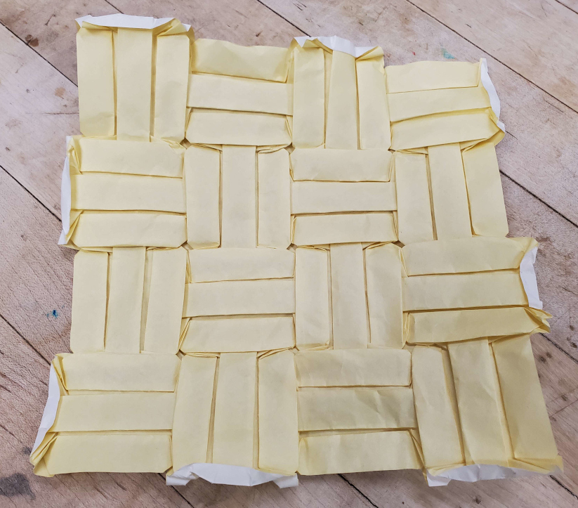

    <figure>
        
    </figure>
    <figure>
          
    </figure>

I challenged myself to make a basketweave pattern where 3 strips travel in parallel, seeing as 2 could be solved with square twists and pleats. Just like
the [(2, 2)-twill](../2-2-aya-ori/), you could bring the rectangles arbitrarily close together, with paper usage efficiency approaching 1. However, to get the weave look,
the rectangles must be separated, and it'd be nice if they were separated by a nice amount. Hence the crease pattern above. There is the problem that you can see some
small diagonal "cut corners" at the intersections of the weaves, but fixing that requires more space or narrower pleats.

Note that the pattern is closed. At least at the time, I thought an open weave would be much harder
to design, though I'm not sure if this is the case now since I have ERM.

When folding it, though, I printed the crease pattern and creased a 25cm piece of kami over it, because I didn't feel like doing an 80 grid and dealing with all the extra
crease lines that that comes with. And just like the (2, 2)-twill the collapse was brutal. You basically have to collapse the whole thing at once.

A similar-looking pattern can be found in *Twists, Tilings, and Tessellations* by Robert Lang, Figure 6.57. That one is kind of an open 2-way basketweave, but strips
seem to disappear under the gap between perpendicular strips (fixing this is what I thought was the hard part of doing an open weave back then.)

Update: while writing this article, I found a way to fix the problem with the open 2-way basketweave, with a minimum pleat width 1/4 the width of the original strip
(the same as for my closed 3-way basketweave):

    <figure>
          
    <figcaption>A proper open 2-way basketweave. Fold this if you dare.</figcaption>
    </figure>

