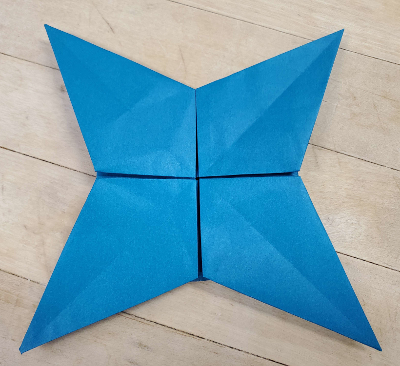

    <figure>
        
    </figure>
    <figure>
          
    </figure>

[Link to the diagram](diagram.pdf)

Just a 4-point star whose points have 45° angles. It was a simple model to design. When folding this model, note that the structure in the center is what I like to
call a *pleat twist*[^pleat-twist]. You don't fold any pleat first or last, you fold all the pleats at the same time, and the center twists and untwists to get a nice 4-way symmetric
fold that locks much better than any order where a pleat is done last (Steps 13-20). This was annoying to diagram, and I'm not looking forward to digramming this pattern again.

[^pleat-twist]: for lack of a better name