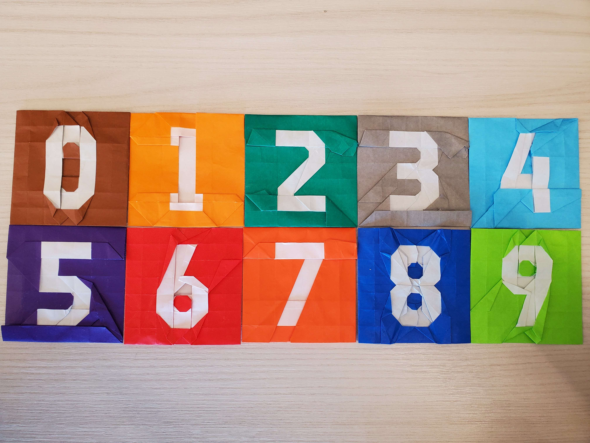
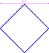
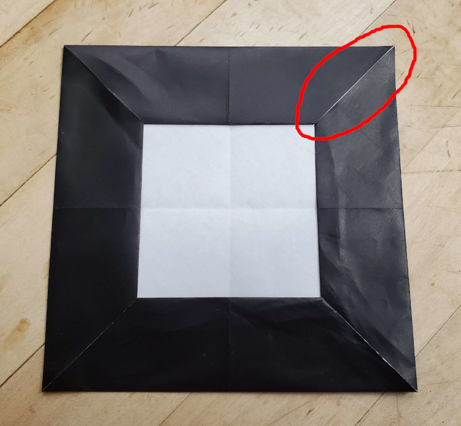
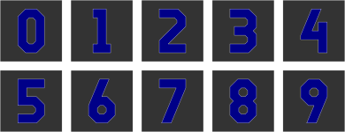
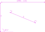

    <figure>
        
    </figure>
    <figure>
          
    </figure>

I made a color change model of each digit, with the following specifications:
* Each digit is mainly on a grid (with "rounded" corners and some diagonal lines), taking up 3 units horizontally and 5 units vertically.
* There is at least 1 unit of space around the digit.
* The model is square (so 7×7).
* No creases go through the back side of the 7×7 square.
* There is no *wrong-color seam*, which will be discussed later.

## Grid Size

Given that every point in the 7×7 square needs to be potentially reachable by a flap, we need at least enough material to do a blintz fold (that is,
to bring each corner of the paper to the center.) This will give a size of $$7\times\sqrt{2}\approx 9.899$$.

    <figure>
        
        <figcaption>Blintz fold.</figcaption>
    </figure>

This is nice and all, but with just a blintz fold, each point can be reached by only 1 flap. If that flap can't make the correct part of the digit, it's
game over. And besides, you end up with a big X-shaped front-color seam reaching to the corners. X, as in "wrong answer". To create redundancy, we will
embed the 7×7 square in the center of a bigger axis-aligned square, in fact, a 15×15 one. So each edge can reach 4 units into the central 7×7 square,
creating some overlap while still being efficient.

## Wrong-Color Seam

Before we talk about the design process, let's talk about wrong-color seams. A wrong-color seam is just that, a seam that's a different color from both sides of it.[^wcs]
Theoretically, they don't matter, but when you fold a model that has one in practice, they can be clearly visible. As an example, let's try to fold a simple color-change
square:

    <figure>
        
        <figcaption>The color change square. Blue: front. Gray: back.</figcaption>
    </figure>
    <figure>
          
        <figcaption>The crease pattern.</figcaption>
    </figure>
    <figure>
        
        <figcaption>The theoretical result. Note the 4 seams.</figcaption>
    </figure>

It theoretically works! There's some seams, but when you're folding a face which a hole in it in a color change model, you'll need seams. The problem isn't the seams. The problem
is what happens when you fold it in real life.

    <figure>
        
        <figcaption>The actual result.</figcaption>
    </figure>

There's some white leaking through one of the seams, even though there's black on both sides of the seam. This is a wrong-color seam, and we should avoid it. This can be done
with overlap, and is part of the reason why our grid size (15) is more than twice the side length of the intended square (7).

## General Design

    <figure>
        
        <figcaption>The intended results.</figcaption>
    </figure>

These models were designed mostly by fiddling around with a 15×15 grid of paper and coaxing it into the correct shape. Some notes:
* The left edge of the paper can reach 4 units to the right in the target shape. This, for example, allows it to (barely)
reach the left edge of the right-side vertical line in the 0, which turned out to be very useful.
* Rounding the corners is generally done using a rabbit fold whose hinge crease goes perpendicularly to the edge. This prevents wrong-color seams from happening.
* There's a really cool fact that allows us to get a nice approximate reference on those 22.5°-aligned diagonal lines on the 4, 6, 7, and 9.

    <figure>
        
        <figcaption>The cool fact of the 22.5° line. If you have a width-2 bar angled 67.5° from the horizontal, and start at some point on the left edge,
        move up 2 units, and move right 3 units, you end up <i>really close</i> to the right edge of the bar. (If you move 2.993... units, you end up on the edge)</figcaption>
    </figure>

## Specific Design

Some notes for specific numbers here. Not that many, though, as like I said, this was mostly done by fiddling around with paper.

### 0

This one fell suprisingly quickly. I thought it was going to be one of the harder numbers to construct.

### 1

The easiest one to construct. Just some grid-aligned and diagonal folds. There's a couple of nasty fold-insides at the end, though.

### 2

Also fell more quickly than I expected, even with the long diagonal line. I used one of the rounded corners (the inner side of the upper corner) structurally (instead of having
it be an approximate fold). That was a bad idea, but I stuck with it.

### 3

This one was tricky with the 3 things sticking out at the left side along with the concave corner at the right. The model isn't symmetric and I didn't try to find a symmetric pattern. Whatever. The same note for the 2 about the structural rounded corner applies here.

### 4

This one was also tricky, given the complicated pattern that must be constructed at the upper-right, with the upper-right corner of the paper having to do most of the work as the other sides are mostly busy with other parts of the pattern. I once had a solution that I rejected because it had an unfixable wrong-color seam.

### 5

An easy one, not much to say about it.

### 6

A little tricky, but not having loops on both the top and the bottom meant that I could fit it more neatly on the grid.

### 7

A pretty easy one, as expected.

### 8

Oh boy. I fiddled and fiddled and just couldn't get the shape to work out without doing an awkward shift of the paper, so the pattern is mostly at an angle here. This was the trickiest model to both design and fold given the off-grid stuff that must be done. And on top of it, you must do it like 4 times.

### 9

This is literally just an upside-down 6.

## Diagrams?

So, I have some diagrams for the first 8 digits, but they're currently somewhat inconsistent (some make you crease references for all the rounded corners and some make you
fold them to taste), and there are some updates I need to do to them anyway.

* [Diagram for the 4/15 Base, which all the numbers have as their first step](diagram-base.pdf)
* [Diagram for 0](diagram-0.pdf)
* [Diagram for 1](diagram-1.pdf)
* [Diagram for 2](diagram-2.pdf)
* [Diagram for 3](diagram-3.pdf)
* [Diagram for 4](diagram-4.pdf)
* [Diagram for 5](diagram-5.pdf)
* [Diagram for 6](diagram-6.pdf)
* [Diagram for 7](diagram-7.pdf)

[^wcs]: More formally, a folded state has a *wrong-color seam* if there exists a continuous perturbation $$\mathcal{P}: R^{\ge 0}\to R^{2|V|}$$ specifiying the current configuration at a given time (preserving layer ordering), where $$P(0)$$ is the initial configuration, such that there exists a $$d > 0$$ such that for each $$\varepsilon > 0$$, there is a visible point in the folded state of $$P(\varepsilon)$$ that is not its intended color and that is distance at least $$\delta$$ from the intended color boundary. I believe there's a combinatorial algorithm for detecting wrong-color seams in a model (Choose a seam that has the same color on both sides. Pick a side that isn't partially hidden by the top face of the other side. If the top face of the side you picked has a fold at the seam, remove faces up to and including the other face of that fold. Otherwise, just remove the top face. Repeat on the same seam until the seam disappears (in which case it's not a wrong-color seam) or the color on one side of the seam changes (in which case it is a wrong-color seam)). However, I don't have a proof that it's equivalent.