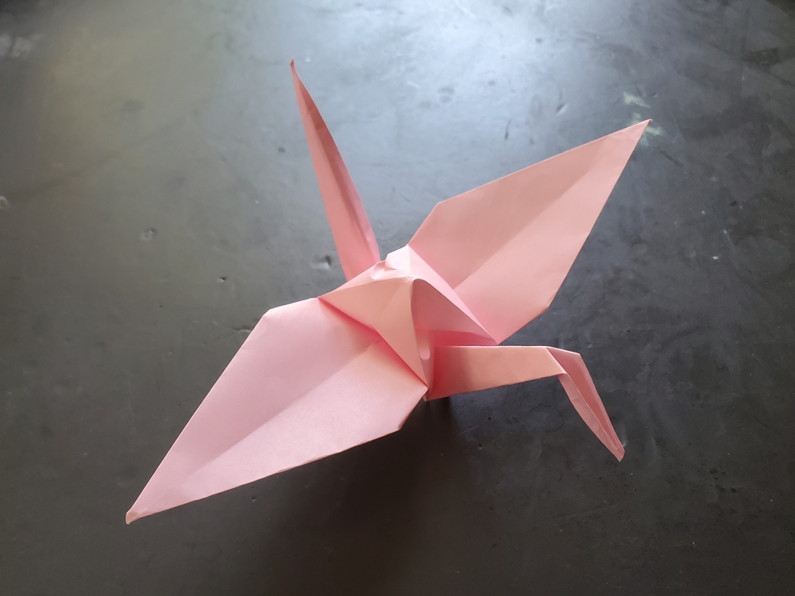

    <figure>
        
    </figure>
    <figure>
          
    </figure>

*The **regular crane** has its neck and tail high in the air, with its wings spread out, flying with grace.*

Yep, it's the traditional crane. Nothing special about it. However, at the time, I didn't know how to fold a crane, and the instructions that came with the paper
weren't clear enough about some middle step. I spent about an hour, and had to look at both the instructions and a crease pattern I found, to finally figure this
mystery out. How embarrassing.

Now I can truly begin the variations!