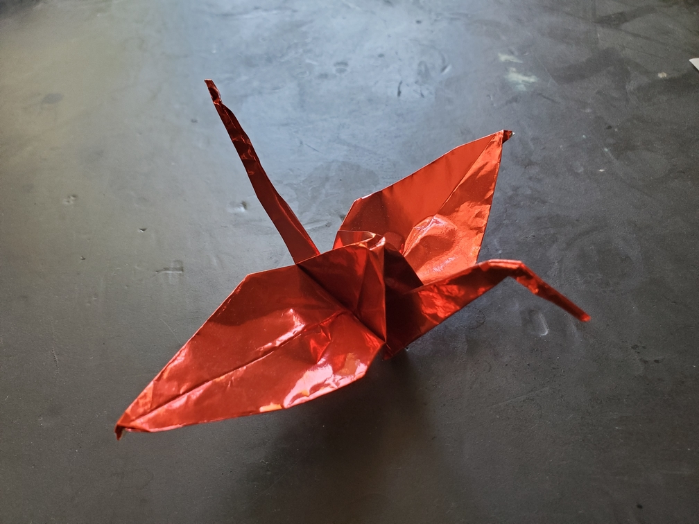

    <figure>
        
    </figure>

*The **shiny crane** flies just as elegantly as the regular crane, but its extra shininess is sure to catch the attention of onlookers all around. Let's just hope predators aren't among the onlookers. Perhaps they'll get blinded by the reflected light and retreat.*

Starting the variations off with simply changing the material. This time, instead of regular origami paper, we used foil paper. Foil paper holds its folds and shaping better,
and it's also shiny, which can be a benefit or a defect, depending on how you want the model to look.