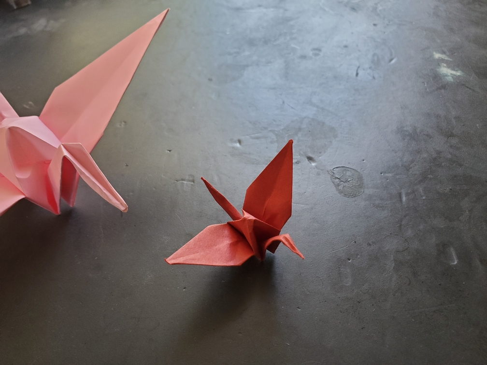

    <figure>
        
    </figure>

*The **small crane**, extra nimble, flies in more erratic patterns. Is it trying to show off?*

Another simple variant. The regular crane is made with 6-inch paper, but the small crane is made with 3-inch paper. The regular crane is partly shown to scale.