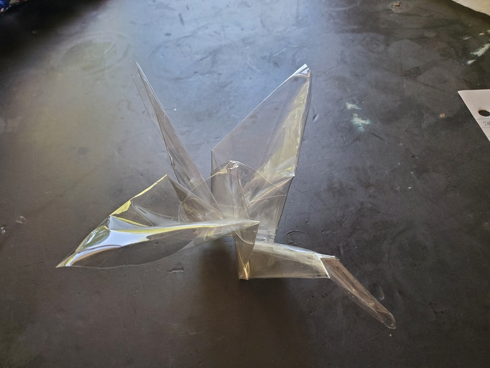

    <figure>
        
    </figure>

*The **transparent crane** flies unnoticed by those around. When it perches on a branch, if another crane comes by, it must move out of the way or get bumped into. The good news is that it can pull some particularly nasty pranks.*

Yet another simple variant. I took a sheet of plastic (I forgot what type, but Avery sells the one I got and it's intended for inkjet printers) and folded it into a crane.
This plastic turned out to be a *lot* more elastic than paper[^pe], making it hard to get intermediate steps to stay flat. Thankfully, the final crane is a good lock and
turned out well.

[^pe]: which is funny, since *plastic* deforms more *elastically* but *paper* deforms more *plastically*.