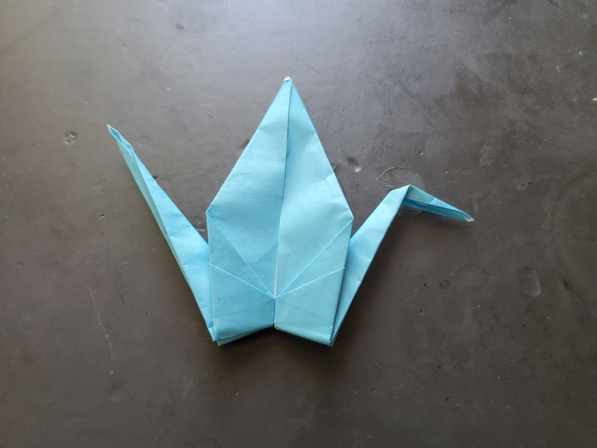

    <figure>
        
    </figure>

*The **flattened crane** once flew, but has been squished flat, never to fly again. How pitiful.*

Simple. You just fold the crane, but don't do the final step where you open up the wings.