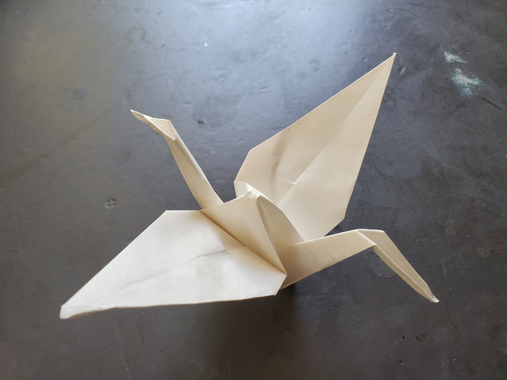

    <figure>
        
    </figure>

*The **head front-and-back crane** flies forth into the great skies. Or does it fly backward into the great skies? Due to its symmetry, one can never tell. It's even known to reverse direction without turning around.*

This time, both the front and back sides are reverse-folded to make heads. This gives a crane with even more symmetry.