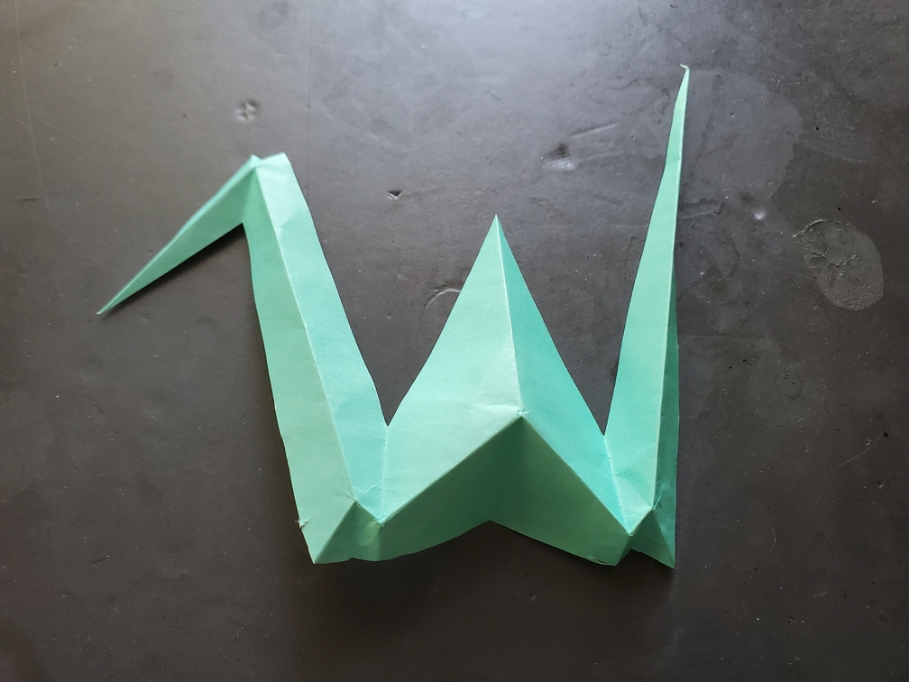
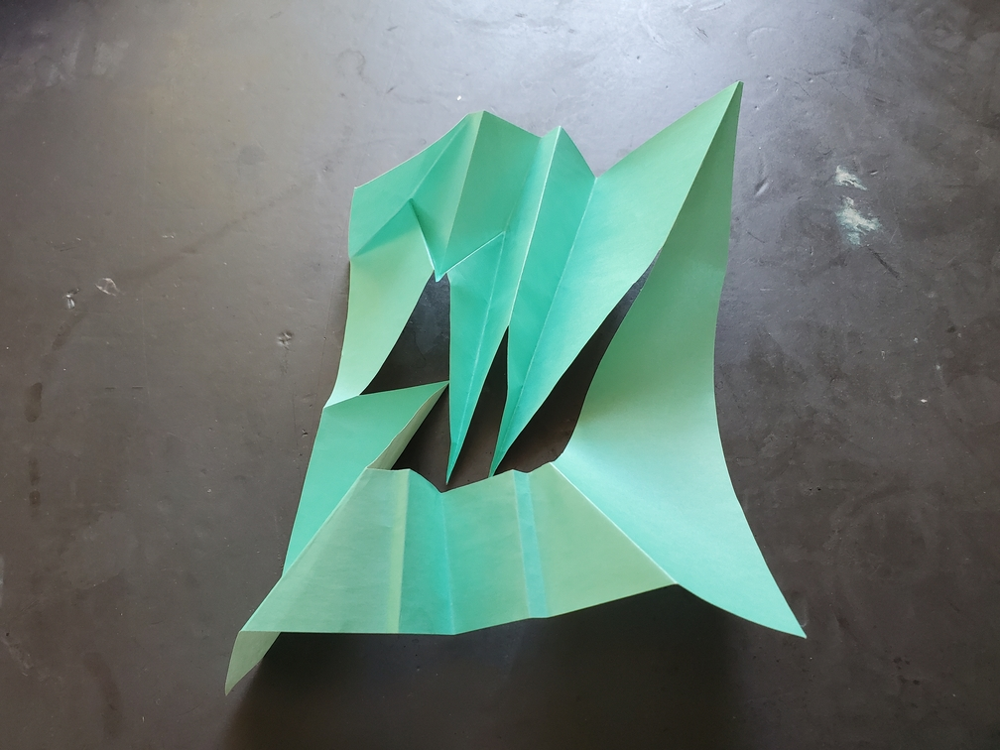

    <figure>
        
        <figcaption>#7: One-Cut Crane</figcaption>
    </figure>
    <figure>
        
        <figcaption>#8: One-Cut Hole Crane</figcaption>
    </figure>
    <figure>
          
    </figure>

*The **one-cut crane** has an interesting story. Once upon a time, the paper of life was folded just so, that when the sword of division attacked with one swing, a beautiful crane came out of it.*

*The **one-cut hole crane** is the hole left behind. A reminder of the miracle that formed the one-cut crane.*

This crane is based on the *fold-and-one-cut* problem, where you fold a piece of paper such that when you cut it with one straight line at a certain angle, it gives you the shape you want. [This problem has been solved](https://erikdemaine.org/foldcut/) with two different algorithms: a straight skeleton algorithm (which is more practical and works almost all the time, except that it can create dense creases), and a disk packing algorithm (which works always, but is less practial). I used the straight skeleton algorithm for this. Thankfully, there aren't any middle flaps, as those can get tricky to deal with.[^middle]

The cranes were folded by printing the crease pattern, taping it to some origami paper, creasing the creases, and then separating the origami paper and collapsing. Afterwards, I cut at the appropriate position and angle.

[^middle]: I once tried to fold-and-cut a whole message (only a few words), and the word in the middle (I think it was "BIRTHDAY". It was a while ago.) was so full of middle flaps that I gave up and just cut each letter individually. Middle flaps are such strong enemies.