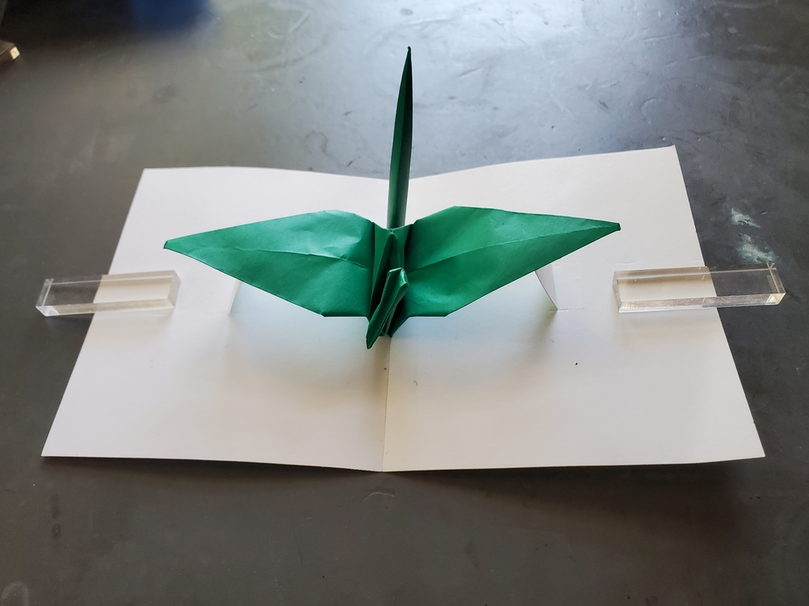
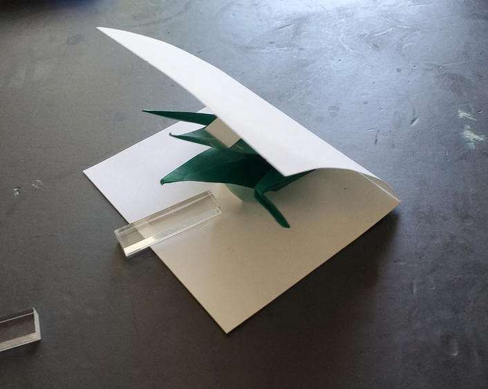
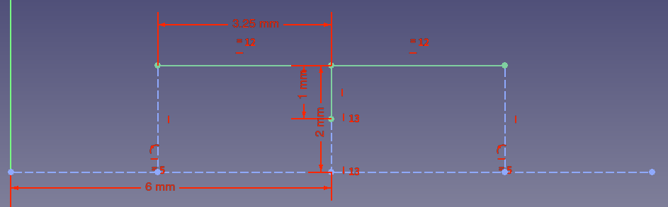

    <figure>
        
    </figure>
    <figure>
        
        <figcaption>The pop-up crane being closed</figcaption>
    </figure>
    <figure>
        
        <figcaption>The FreeCAD plan. Each mm is actually an inch.</figcaption>
    </figure>

*The **pop-up crane** hides among the leaves of the trees. When the wind comes and blows some leaves apart, it suddenly pops out and flies.*

This is basically a crane inside a pop-up card. After making each letter of the alphabet as a 2D pop-up card (unpublished as of 2026-05-20), constructing this one was easy. I used
cardstock to build the structure for the pop-up card, and then put the crane on top.