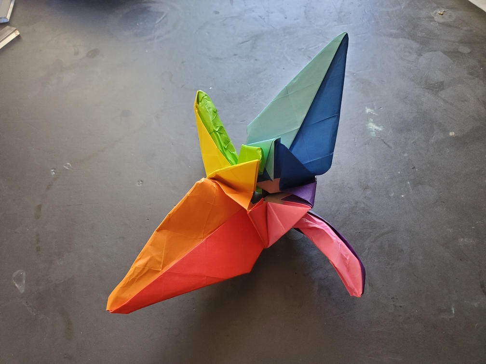

    <figure>
        
    </figure>

*The **rainbow crane** is the literal embodiment of flying colors. Perhaps even more dazzling than the shiny crane.*

This crane is made from 8 colors (red, orange, yellow, green, cyan, blue, purple, pink) arranged in a circle. First, I took 8 pieces of paper and folded them up to make a modular big square. I forgot exactly how I did this (don't worry, the result was bad anyway), but depending on the parity of the color, each piece was folded into a shape that I nicknamed either a "georgia" or a "south-carolina". The georgias and south-carolinas had places to insert the others inside them. One problem is that there was a hole in the center, but this is a fundamental problem, as if any color fills in that hole, you break symmetry. This is why the crane has a hole in its back. And besides, it's very thick. Perhaps if there is a next time, I should just make tissue paper using these 8 colors instead.