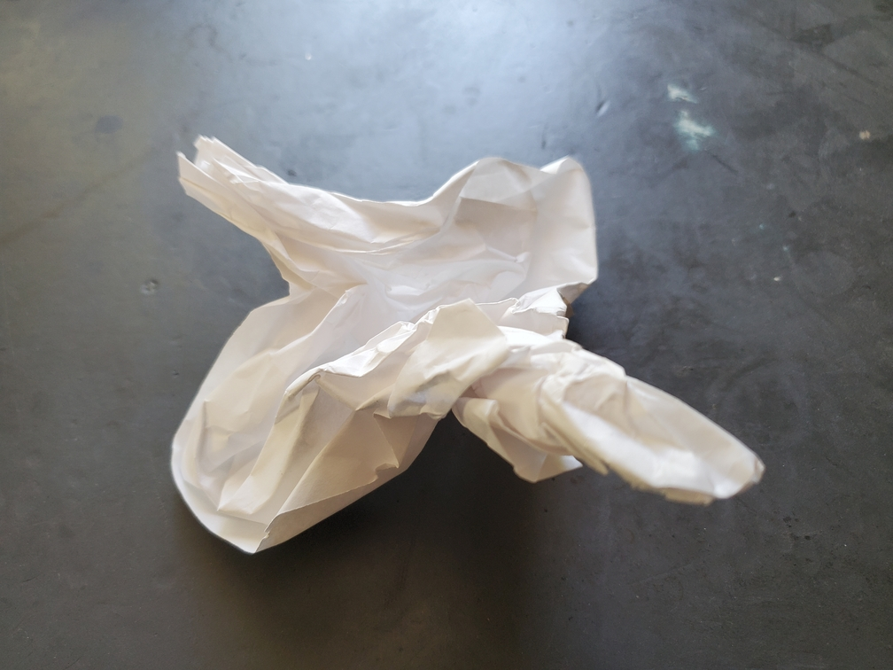

    <figure>
        
    </figure>

*The **crumpled crane** attempts to fly, but can't due to the absolutely awful aerodynamics caused by the crumples in its wings. At least the flattened crane looked nice, but this one doesn't even do so. The laughingstock of cranes all over.*

As a joke, I crumpled up a piece of paper and shaped it into a vague crane shape. No, I'm not showing the crease pattern. I'm not Tomohiro Tachi.