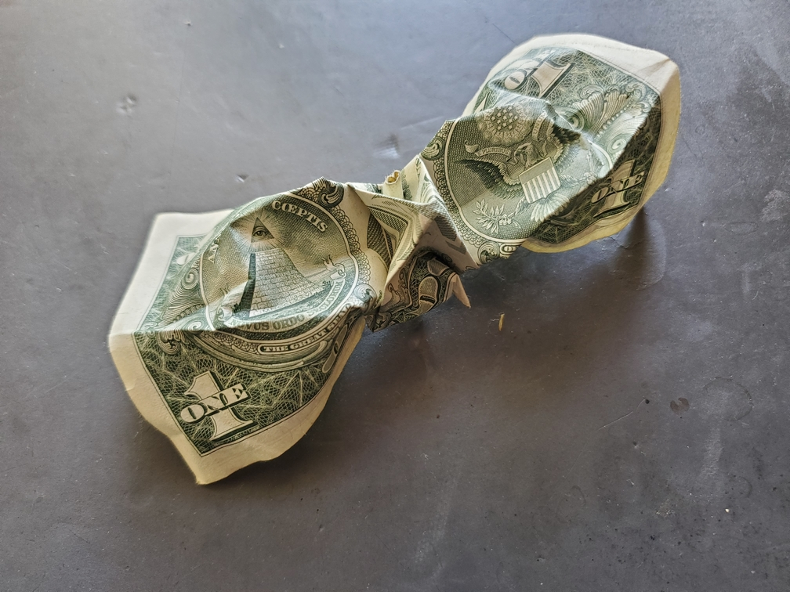

    <figure>
        
    </figure>

*The **broad-wing dollar crane** flies through the air, showing its worth. Well, unfortunately, that worth happens to be just 1 dollar. It stays away from markets, as it is easily bought.*

This time I attempted to use a dollar bill to fold a crane. I'd say it was an average material, but it's been a while. This was done by rotating the crease pattern so that the ends of the dollar bill are the wings. But because of the aspect ratio, the wings became awkwardly wide and the neck and tail very short. Oh well.