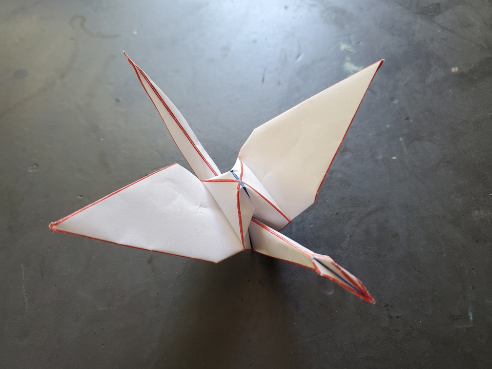

    <figure>
        
    </figure>

*The **crease pattern crane** shows how its made. Anyone planning to control the paper of life can look to the crease pattern crane for guidance.*

So you know the cheaty way of doing origami? You print a crease pattern, crease the creases and then collapse. This causes the crease pattern to show, which is usually a bad look on the model, but in this case it's intentional. My origami background is geometric and computational, and before getting into other origami, I used to print my crease patterns.