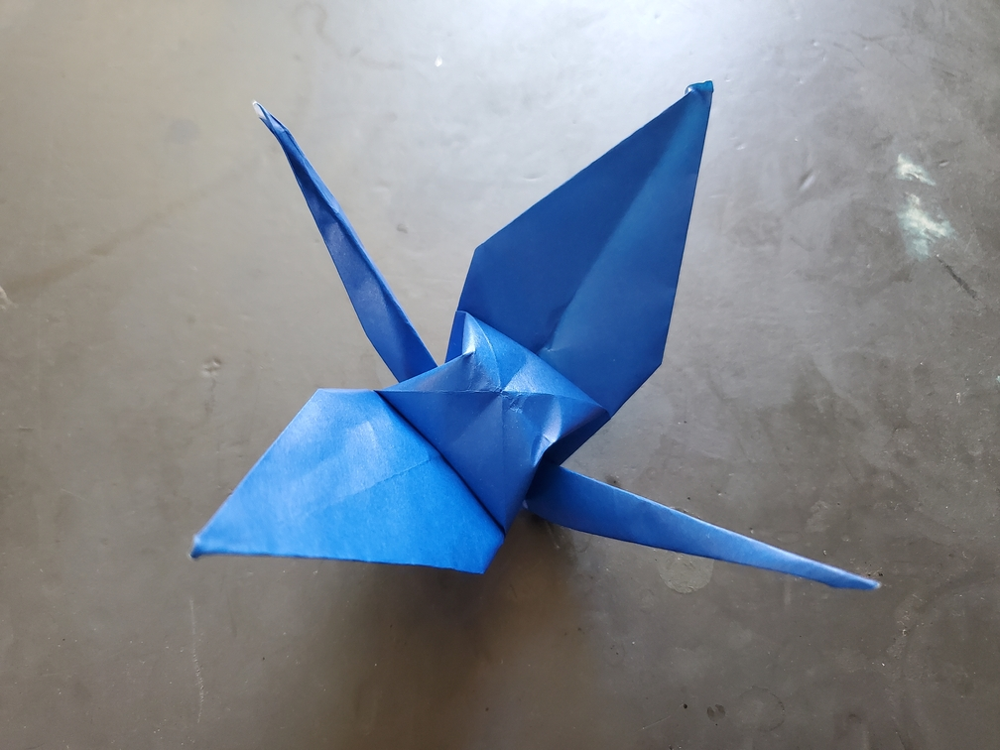

    <figure>
        
    </figure>

*The **tail front-and-back crane**, like the head front-and-back crane, is mysterious about the direction it flies. However, some say that it simply has its head high up in the air, seeming proud of itself.*

For this one, I just folded a crane and skipped the step where you inside-reverse-fold the head, giving another extra-symmetric crane. Apparently [it is tradition (Japanese source)](https://origamiplans.hatenablog.jp/entry/20040806/p3) to not fold the head on a crane intended for visiting a sick patient.