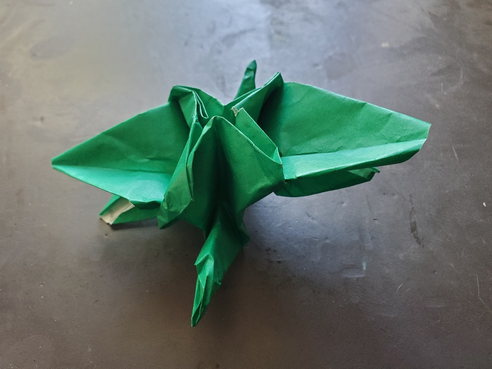

    <figure>
        
    </figure>

*The **four-winged crane** flies with more wings than a regular crane. This doesn't give it much extra flying power, however.*

I took a square and where you would normally fold a Square Base, I folded a vertex with 12 fold lines instead of 8, giving 6 flaps. Then I tried to do the regular crane folding method, but with 2 extra wings, and... it didn't work out so well, but here we are. The extra wings got tucked under and it was hard to pull them out.