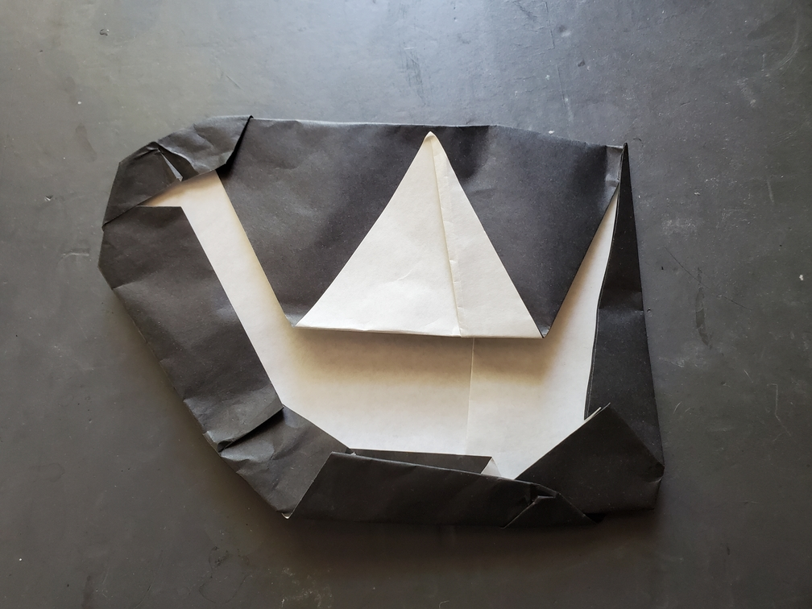

    <figure>
        
    </figure>

*The **color change crane** doesn't fly like the other cranes. It's just a unique silhouette that resembles a crane.*

This color change pattern was folded by taking some paper and messing around with it until it looked like a crane. Nothing special, and don't make me replicate it.