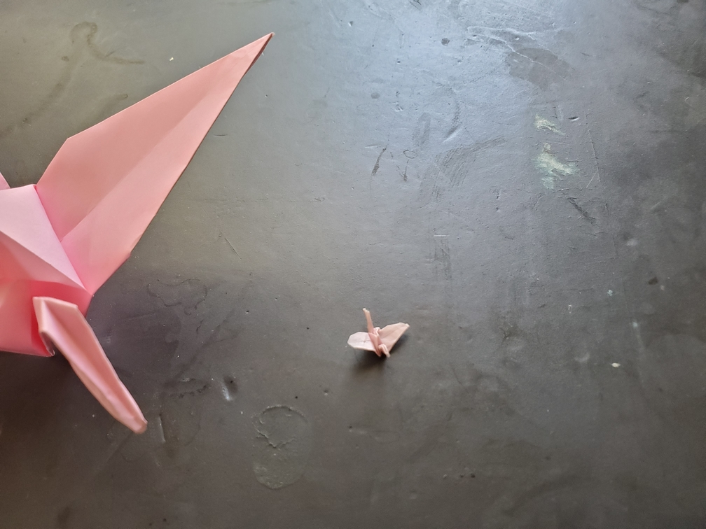

    <figure>
        
    </figure>

*The **tiny crane**, with it's tiny size and ridiculous maneuvering, is often confused with a flying insect, but it is in fact, a crane. Among the smallest of cranes.*

This crane was made from a 1in×1in square, and I'm not folding anything smaller. I'm amazed at how well it turned out. This definitely required using tweezers a lot.