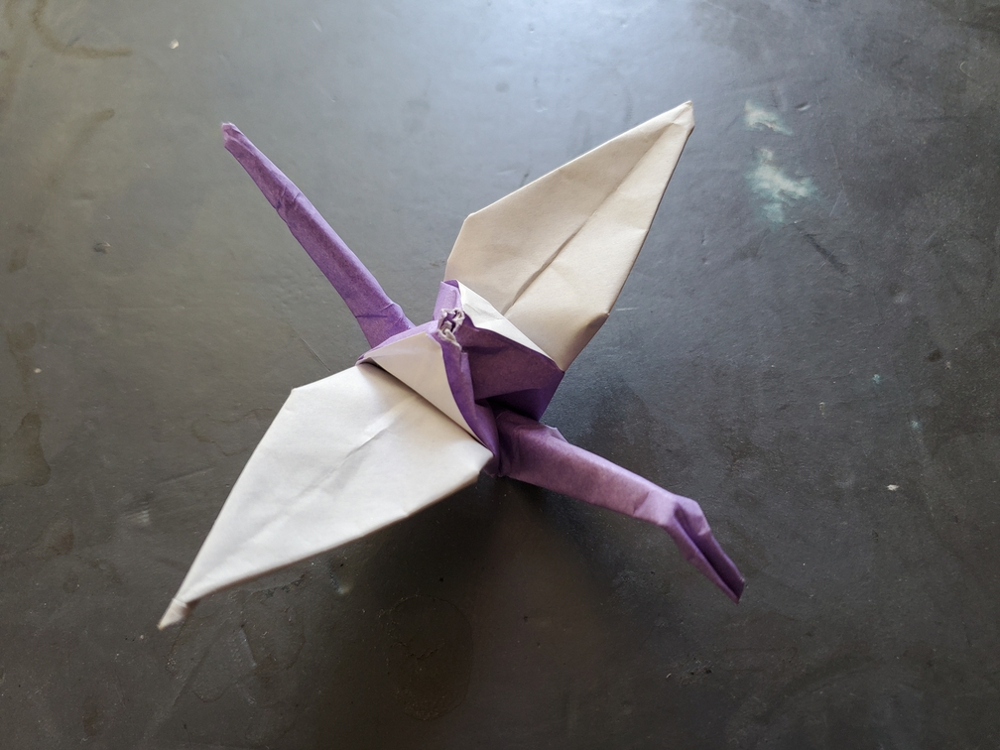

    <figure>
        
    </figure>

*The **different-color wing crane** shows off its specially-colored wings, bringing a certain charm that other cranes don't quite have, without looking as dazzling as the rainbow crane.*

I did something similar to a zabuton fold, except that two opposite corners get folded the other way instead. Then by doing a regular zabuton fold, I got a 2×2 checkerboard, which I then folded the crane from. There's probably more efficient ways to get a 2×2 checkerboard, but this one is symmetric.