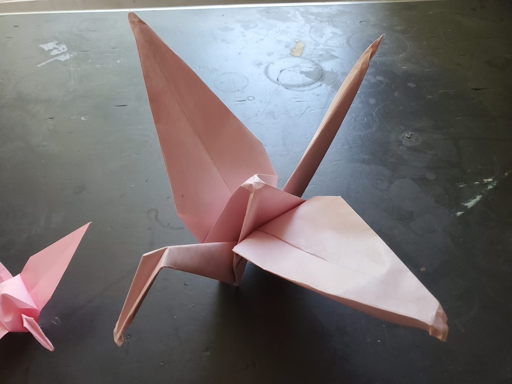

    <figure>
        
    </figure>

*The **big crane** flies majestically through the wind, cutting through air like a knife through hot butter. Other cranes know to watch out and avoid getting caught in the wake.*

This was folded with 35cm×35cm paper, about 3 times the side length of the one used for the regular crane. Not much to say other than that it's harder to get it to stand properly.