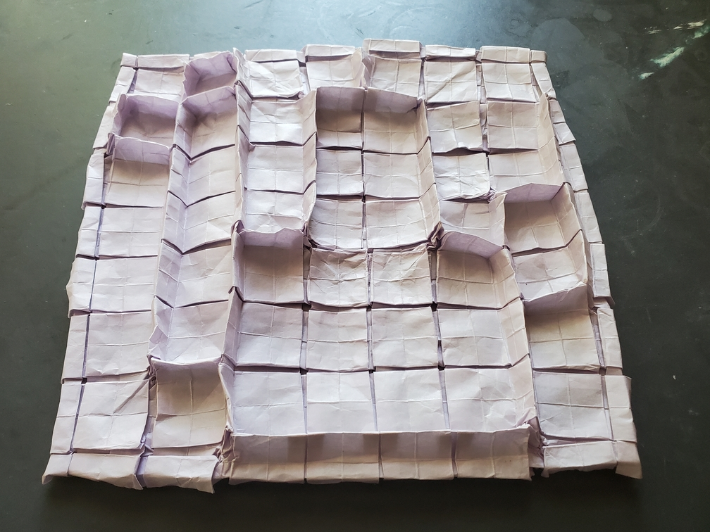
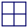
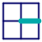
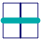

    <figure>
        
    </figure>
    <figure>
        
        <figcaption>The abstraction.</figcaption>
    </figure>

*The **orthogonal maze crane** is a hedge-like maze planted in the great crane plains. It's easy to get lost in the many entrances and exits of this maze, but when looked at from afar, the big picture can be seen.*

So, there's [this paper](https://erikdemaine.org/papers/MazeFolding_Origami5/paper.pdf) and [this software](https://erikdemaine.org/fonts/maze/?maze=xxxxxxxxx!xxxxxxxxxx!xx-xxxxxx!xx%7C%7Cx%7Cxxxx!x--x--xxx!x%7C%7C%7C%7Cx%7Cx%7Cx!x-xxxxxxx!xx%7C%7C%7Cx%7Cx%7Cx!xxxxxxx-x!xx%7C%7C%7Cx%7C%7C%7Cx!xxx-xx-xx!xx%7C%7Cxxx%7C%7Cx!xxxxxxx-x!xx%7C%7Cxxx%7Cxx!xx-xxxxxx!xxx%7Cxxx%7Cxx!xxx----xx!xxxxxxxxxx!xxxxxxxxx) about folding an arbitrary orthogonal maze from paper, with a guaranteed final model size of half (in each dimension) of the original paper's size. The way it works is that there are 6 types of vertices that need to be folded: *flat*, *end*, *turn*, *straight*, *T*, and *plus*.

    <figure>
        
        <figcaption>Flat</figcaption>
    </figure>
    <figure>
        
        <figcaption>End</figcaption>
    </figure>
    <figure>
        
        <figcaption>Turn</figcaption>
    </figure>
    <figure>
        
        <figcaption>Straight</figcaption>
    </figure>
    <figure>
        
        <figcaption>T</figcaption>
    </figure>
    <figure>
        
        <figcaption>Plus</figcaption>
    </figure>

Each of them has a gadget that folds it, and the gadgets have compatible interfaces. Some of these lines fold 90° instead of 180°.

    <figure>
          
        <figcaption>Flat</figcaption>
    </figure>
    <figure>
          
        <figcaption>End</figcaption>
    </figure>
    <figure>
          
        <figcaption>Turn</figcaption>
    </figure>
    <figure>
          
        <figcaption>Straight</figcaption>
    </figure>
    <figure>
          
        <figcaption>T</figcaption>
    </figure>
    <figure>
          
        <figcaption>Plus</figcaption>
    </figure>

Putting these gadgets together then gives you the final model. One thing to note is that the flat gadget that I showed is slightly different from the flat gadget used in the paper. The one shown here what I like to call a *pleat twist* and it's my favorite way to fold that pattern. Out of all the ways you can MV-assign the creases for the intersections between pleats, this (and its mirror image) is the only way to do it so that no pleat comes purely last, making this a good lock.