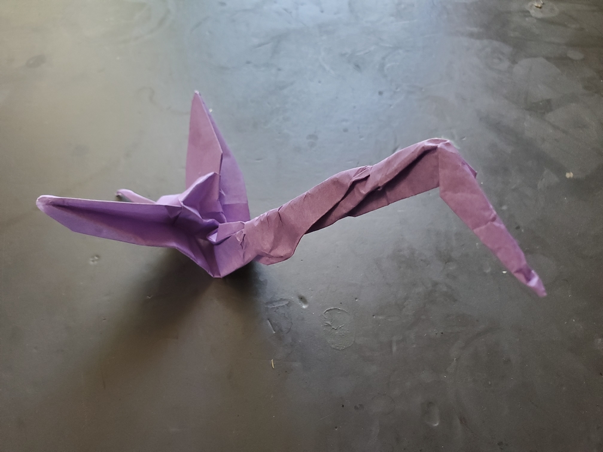

    <figure>
        
    </figure>
    <figure>
          
    </figure>

*The **long neck crane** juts its neck far out and flies. It uses its surprisingly long neck to catch prey from afar.*

To make the long neck, I added a graft to one of the non-wing corners and then folded it. Unfortunately, thinning the neck seemed to require some crumpling. Or maybe it's just a skill issue. But yeah, this was I think my first graft use.