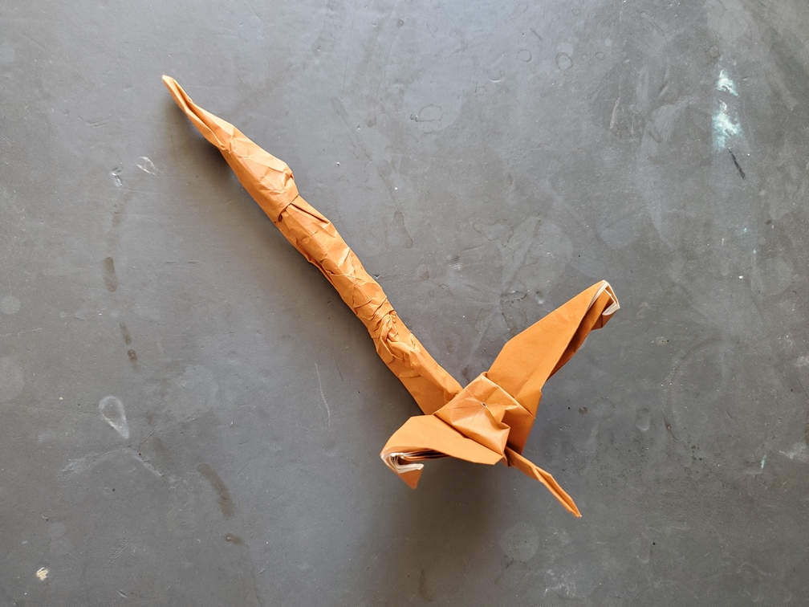

    <figure>
        
    </figure>
    <figure>
          
    </figure>

*The **long tail crane** seems to carry a long weight behind it. It still flies elegantly, though one wonders if its long tail has been confused with a branch and perched on.*

This was made the same way as the long neck crane, with a graft. The only difference is that this time the grafted side isn't the one that then gets inside-reverse-folded.