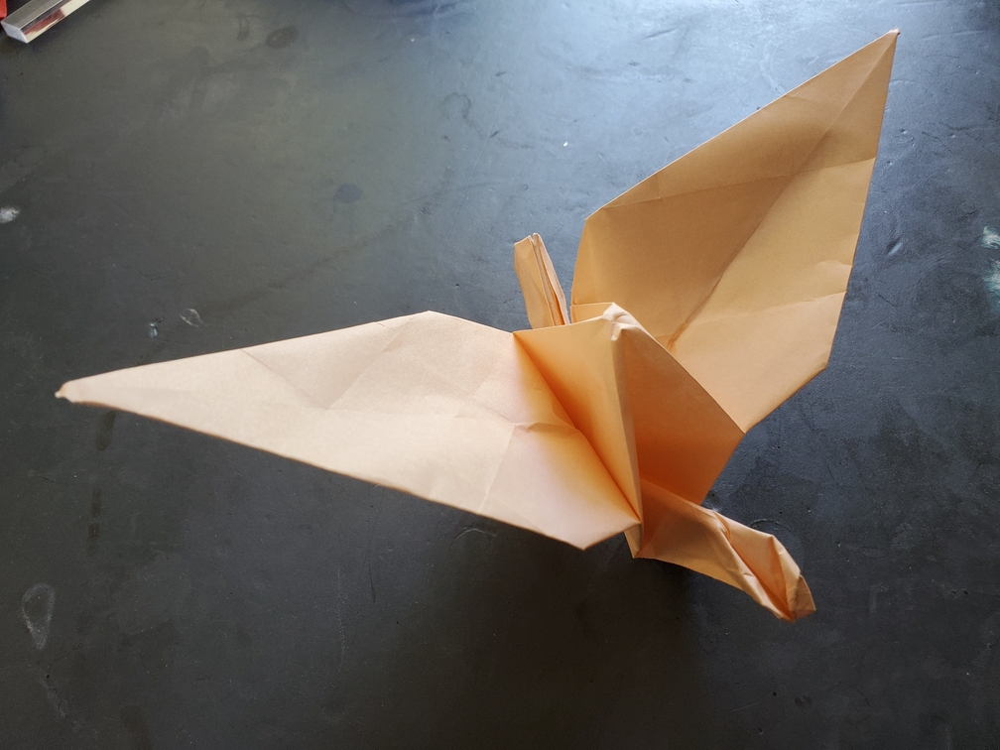

    <figure>
        
    </figure>

*The **long wing crane** has big long wings, allowing it to soar through the air more gracefully than other cranes. It even has fun gliding around the sky.*

This was pretty simple. A graft would just end up covering the entire perimeter, so instead I just used a bigger piece of paper, folded the crane normally, and pleated away some length from the neck and tail.