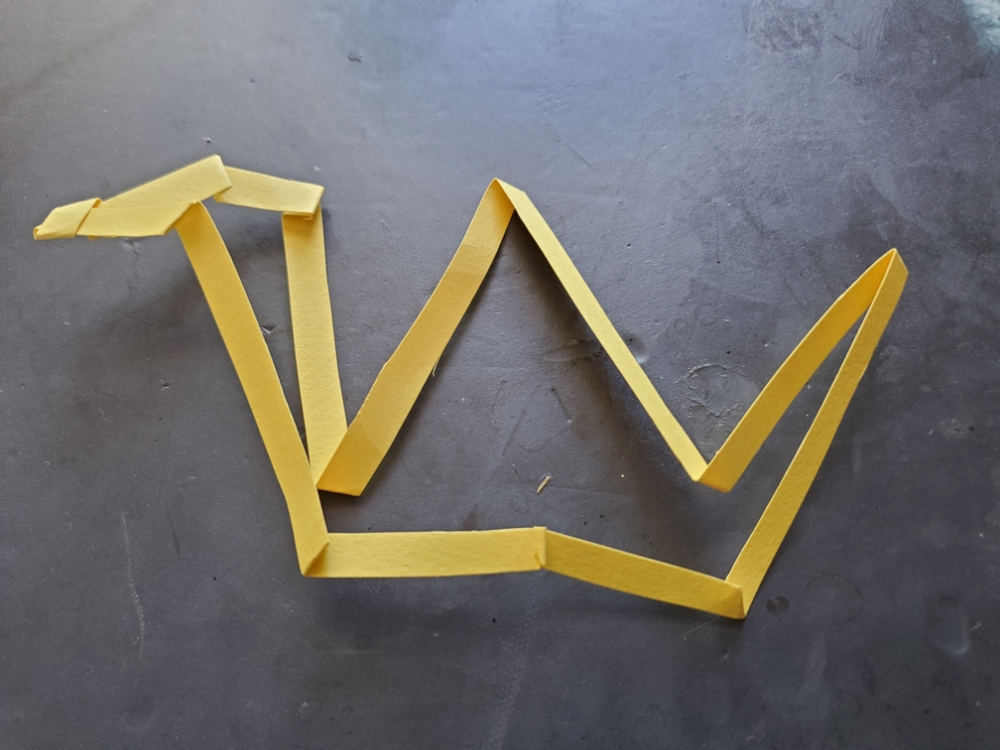

    <figure>
        
    </figure>

*The **outline crane** results from a blue crane flying in the sky, or a yellow crane during sunset, where only the outline can be seen.*

A very unorthodox crane. In fact, the first one that doesn't start from a square. This one started from a really long strip, which was then folded into the outline of a crane.