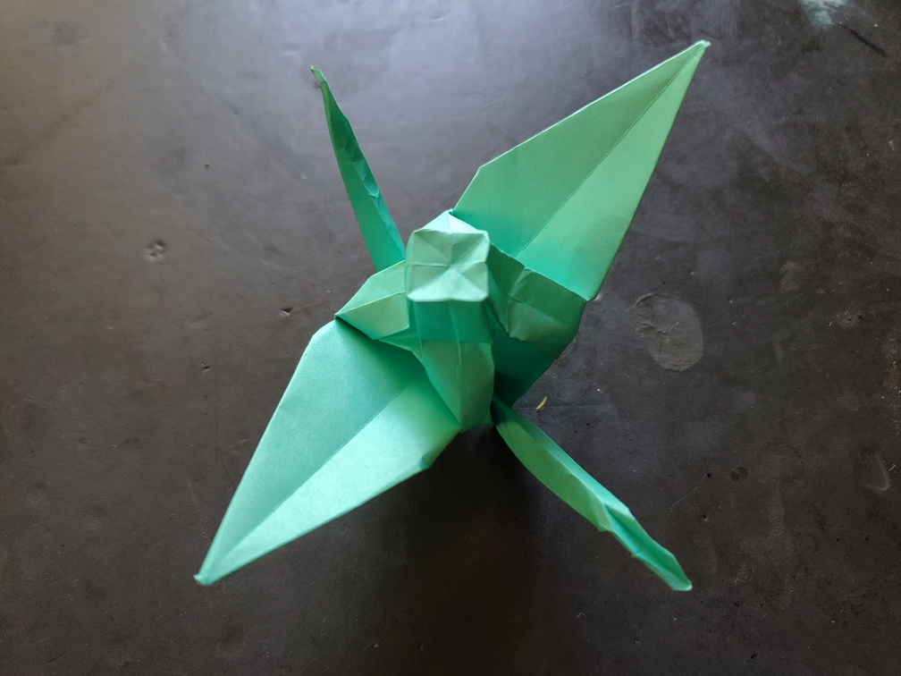

    <figure>
        
    </figure>
    <figure>
          
        <figcaption>Some creases in the box in the center don't fold flat.</figcaption>
    </figure>

*The **box-carrying crane** flies around carrying a mysterious box on its back. Who knows what's inside? Perhaps it's a more advanced delivery crane.*

To fold this, I first folded a box in the center of the crane, using the $$\tan^{-1}(1/2)$$ gadget found in [this paper](https://erikdemaine.org/papers/BoxPleating_Origami5/paper.pdf).
Then I folded a crane around it. Folding a crane around something sticking out is not trivial, however, as you're not allowed to flatten the model. This required some air folding.