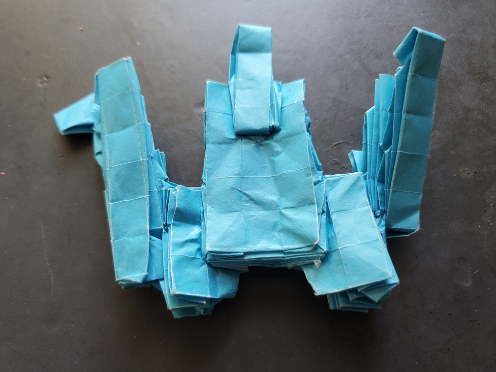
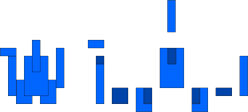
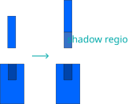
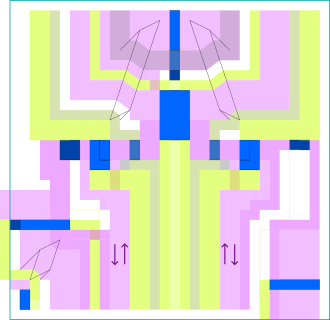

    <figure>
        
    </figure>
    <figure>
          
        <figcaption>Before shaping</figcaption>
    </figure>

*The **polyomino crane** flies in a low-quality very pixellated simulation. One made by some very smart cranes.*

This was edge-river method practice. First, the abstraction and its breakdown:

    <figure>
        
        <figcaption>The abstraction (left) and the breakdown (right). The darker areas are ones that will be hidden.</figcaption>
    </figure>

So, I tried to use this breakdown, but there are some problems with it. The more obvious one is the top side, which has an impossible structure.
The bottom of the stick needs to go 2 tiles deep into the rectangle below it (touching the top middle of the 凹), but doesn't have a way to get there. So let's fix that with
a *shadow region*, which is a region intended to be on the back side[^shadow]. This was a while ago and now I know better to think more about shadow regions than hidden regions.
There's also a problem on the left side, which *can* be fixed with an awkward diagonal crease, but I chose to use a shadow region instead.

    <figure>
        
        <figcaption>Fixing the top side with a shadow region.</figcaption>
    </figure>
    <figure>
        
        <figcaption>Fixing the left side with a shadow region. This one can't be attached to either side.</figcaption>
    </figure>

With that out of the way, here's my ERM map, notated with the notation I used at the time. On second thought, maybe I should have switched the colors for the shadow regions
and hidden regions.

    <figure>
        
        <figcaption>The ERM map. Blue: "lakes". Purple: horizontal rivers. Yellow: vertical rivers. Gray-ish rivers correspond to shadow regions.</figcaption>
    </figure>

As for the actual folding, I made the mistake of using regular kami (even though it was a bigger sheet), because wow, it got *thick*. This was the first model where I needed glue.

[^shadow]: as opposed to a region that simply gets hidden by another region.