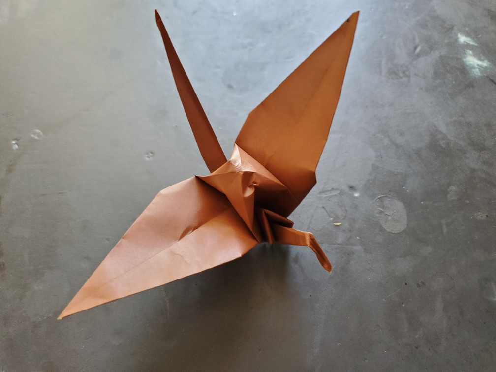

    <figure>
        
    </figure>

*The **short neck crane** flies somewhat gracefully but can't see as well with its wings blocking the way. It relies on other cranes to warn it of predators.*

Pleat the neck. Done. (If I used a graft to just make the other 3 corner flaps longer, it would cover the entire perimeter, so I decided that pleating is better.)