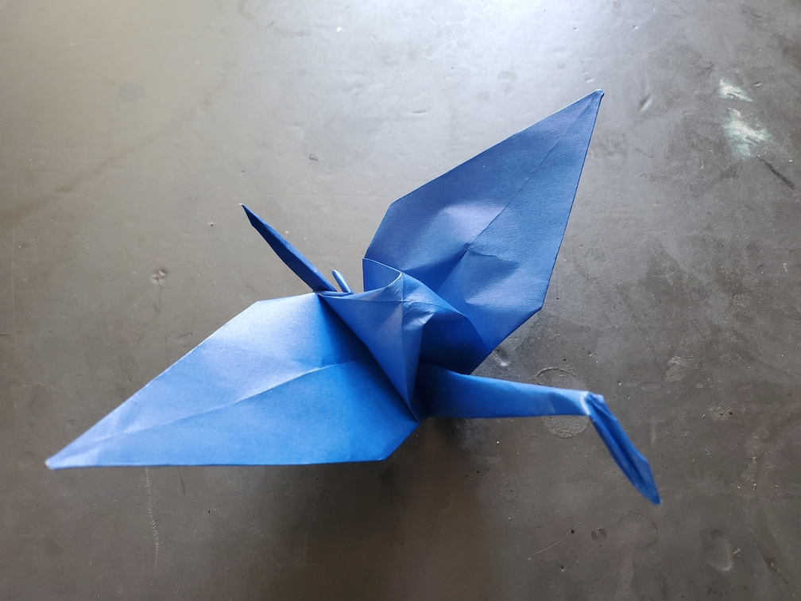

    <figure>
        
    </figure>

*The **short tail crane** flies mostly like a regular crane, but looks a little mysterious. What possible advantage could having a short tail bring?*

Pleat the tail. Done.