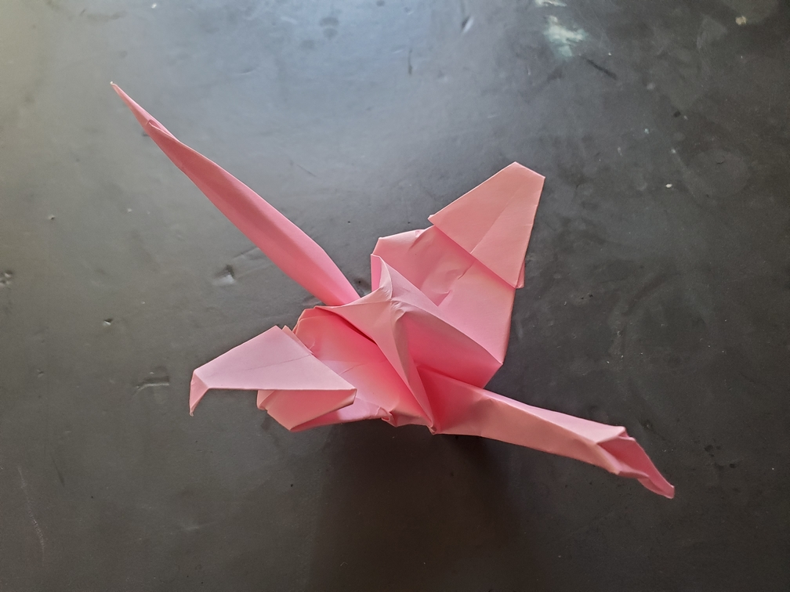

    <figure>
        
    </figure>

*The **short wing crane** has a harder time flying than other cranes. Unlike the small crane and the tiny crane, it still has a normal-sized rest-of-the-body to carry.*

Pleat the wings. Done. (Okay, actually, I probably should have done something better to hide it here since during documentation I thought this was some other crane variant.)