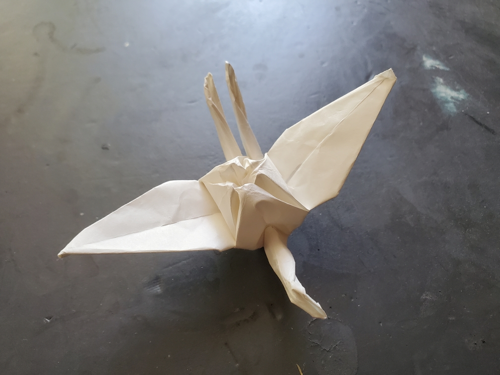

    <figure>
        
    </figure>
    <figure>
          
    </figure>

*The **two tailed crane** flies elegantly, with its twin tails gliding in the breeze.*

For this one, I did the silly thing of taking a square base and making it have 5 sides instead of 4 by using a pentagon instead. This meant that I needed to fold a pentagon
from a square, and it's been a while so I forgot the construction. And there's also the fact that the center vertex is supposed to be winded 450°, which means that
there's short [waffle walls](/2026/06/08/erm-01-introduction.html#waffle-walls) that block the way. But they're short enough that it doesn't really matter. After folding the base,
finishing the crane off was easy.