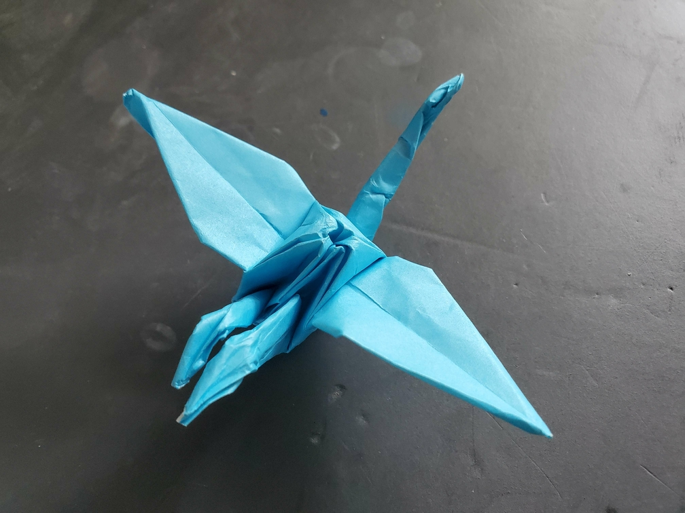

    <figure>
        
    </figure>
    <figure>
          
    </figure>

*The **two-necked crane** somehow manages to fly nicely despite the two necks (and therefore heads). This phenomenon has been called intra-crane-ial communication.*

This is the same as the two-tailed crane, except that the necks and tail switch which one gets the beak folded.