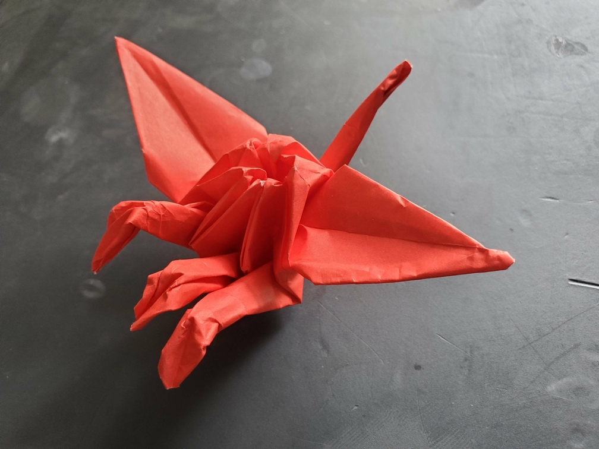

    <figure>
        
    </figure>
    <figure>
          
    </figure>

*The **three-necked crane** requires even better intra-crane-ial communication than the two-necked crane. It spends too much time in the skies to properly guard the underworld.*

This one is inspired by the common depiction of Kerberos as having 3 heads. This was made similar to the two-necked crane, except from a hexagon instead of a pentagon.