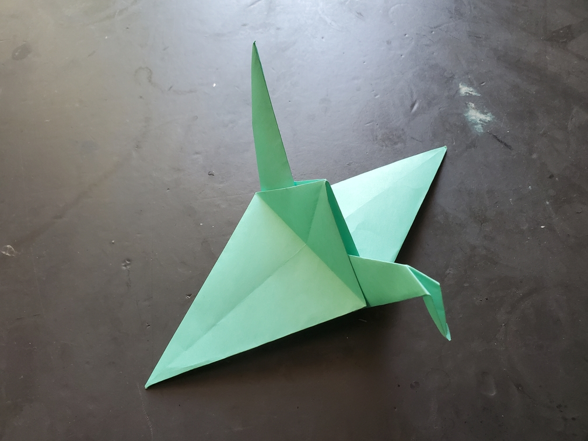

    <figure>
        
    </figure>

*The **fat crane** flies gracefully, because its fat wings provide the lift necessary for its fat neck and tail. Unfortunately, predators think it's extra meaty.*

One easy way to make a variant is to just skip a step in the folding process. This skips the thinning step.