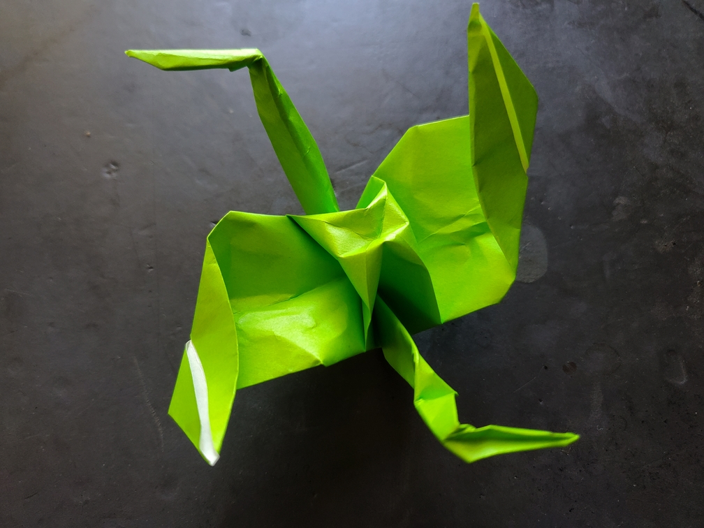

    <figure>
        
    </figure>

*The **manji crane** spins around as it flies, kind of like a helicopter. It must plan out its path carefully, as it can't turn right.*

A crane has 4 limbs, so I took them and folded them all counterclockwise to make a manji. It's a shame the symbol has been ruined in the West because it's such a nice
4-way rotationally symmetric shape that doesn't have reflectional symmetry.