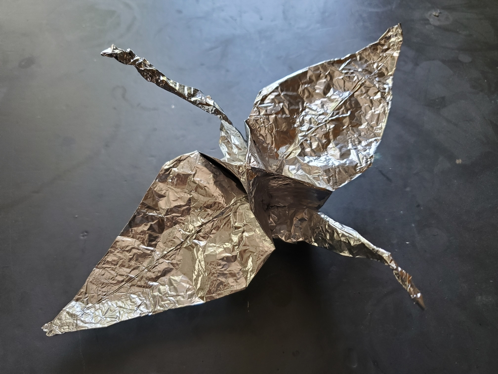

    <figure>
        
    </figure>

*The **aluminum foil crane** flies through the air, making sure to avoid obstacles (like other cranes) as its wings are weak and easily crinkle.*

I used one of the thinnest least-elastic materials out there to fold a crane: aluminum foil. Aluminum foil holds its shape pretty well for a thin material (though the wings
still flop. It's a thin material.), but it's very hard to reverse a crease and very easy to accidentally crinkle a thousand times. Thankfully, it's just a crane. I'm not trying
to fold a super complex model with raw aluminum foil.