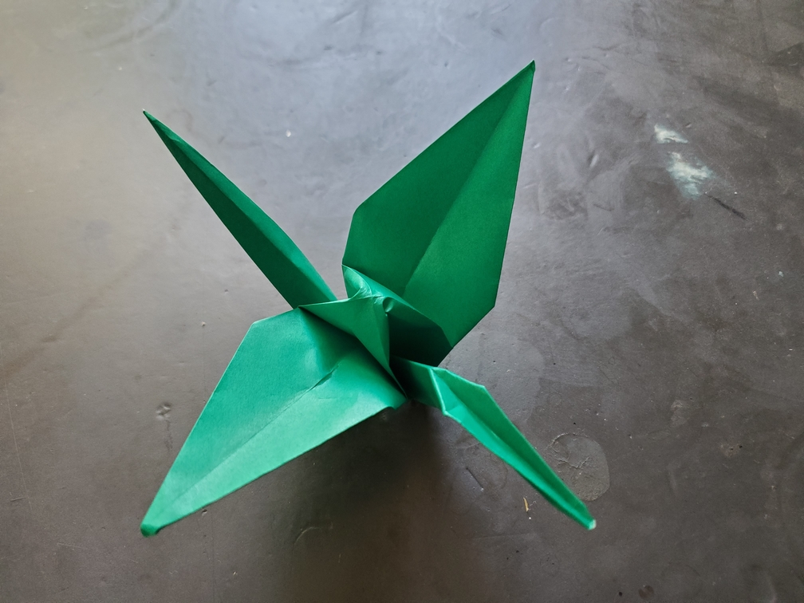

    <figure>
        
    </figure>

*The **long-beaked crane** uses its extra-long beak to surprise and snatch prey straight out of the air. It also likes to occasionally dip close to a water surface and snatch
prey from there.*

Another simple variation. Just change the location of the final inside reverse fold.