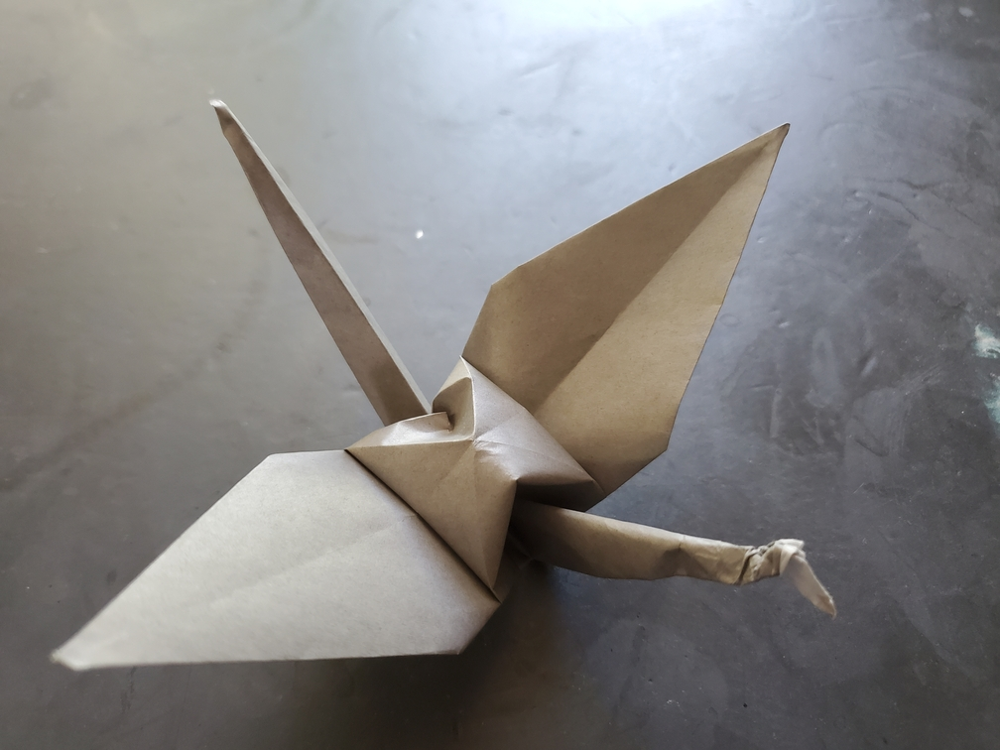
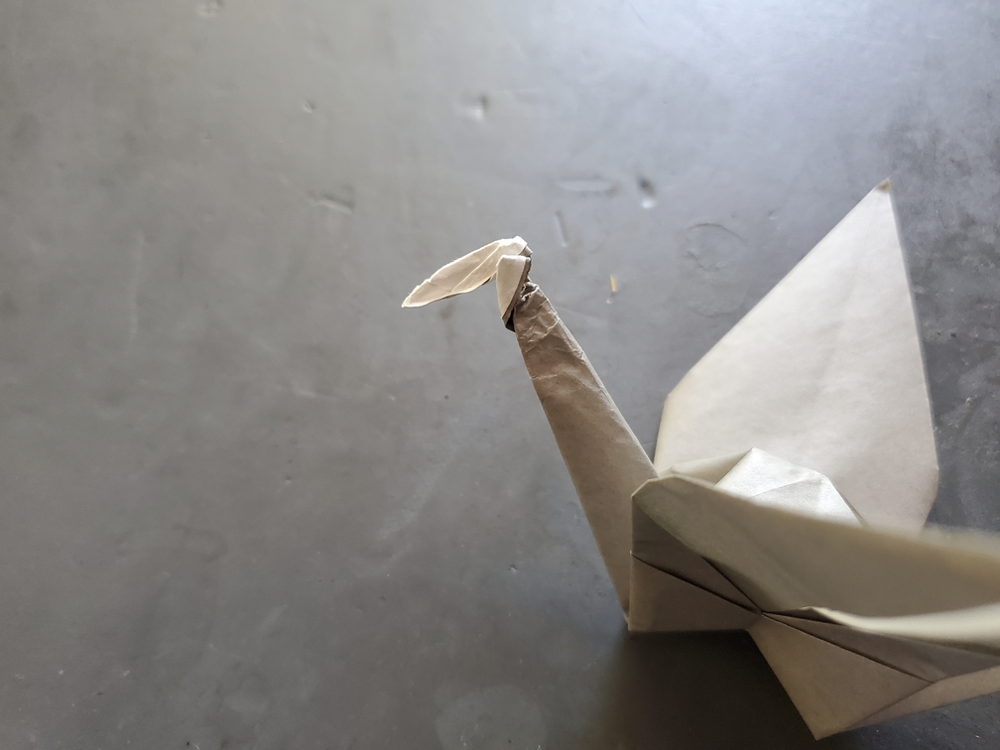

    <figure>
        
    </figure>
    <figure>
        
    </figure>

*The **different color beak crane** seems to warn onlookers with its marked beak. Perhaps it must become a herbivore.*

So this one didn't go so well. I tried to just turn the beak inside out, but it pulled some other material with it. It's probably not mathematically sound, but whatever.
Better luck next time.