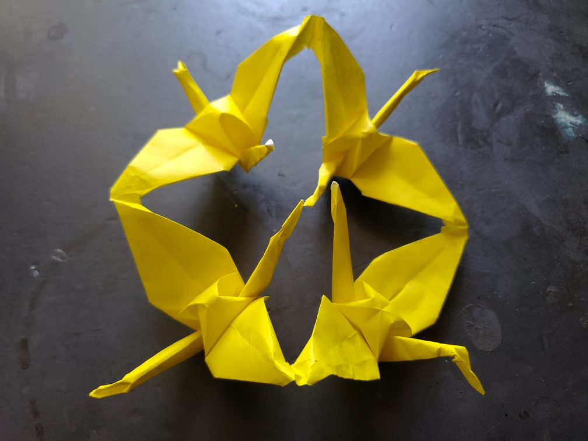

    <figure>
        
        <figcaption>#38: First Cut-Ring Crane / ダイイチキリワヅル</figcaption>
        <figcaption>#39: Second Cut-Ring Crane / ダイニキリワヅル</figcaption>
        <figcaption>#40: Third Cut-Ring Crane / ダイサンキリワヅル</figcaption>
        <figcaption>#41: Fourth Cut-Ring Crane / ダイヨンキリワヅル</figcaption>
    </figure>

*The **first cut-ring crane** flies as part of a crane ring, with the fourth cut-ring crane to its left and the second cut-ring crane to its right. Ironically, despite being the leader, it must fly backwards because it faces inward.*

*The **second cut-ring crane** flies as part of a crane ring, with the first cut-ring crane to its left and the third cut-ring crane to its right. It's very good at flying to its left.*

*The **third cut-ring crane** flies as part of a crane ring, with the second cut-ring crane to its left and the fourth cut-ring crane to its right. It can see what's ahead and warns the leader of obstacles approaching.*

*The **fourth cut-ring crane** flies as part of a crane ring, with the third cut-ring crane to its left and the first cut-ring crane to its right. It's very good at flying to its right.*

Of course, because of the 4-way symmetry, you can't actually tell which one is first, second, third, or fourth.

This one requires cutting a + shape in the center that goes *almost* all the way to the edges but not quite. And then you have to be very careful not to tear the paper while folding
*4* cranes, which is the most stressful part. But I did it.