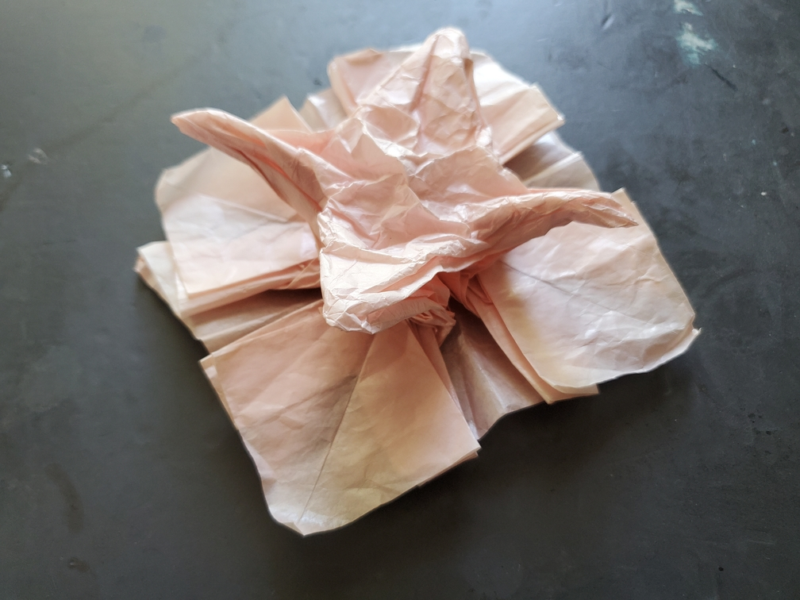
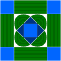

    <figure>
        
    </figure>
    <figure>
          
    </figure>

*The **wrinkly floor crane** sits on a floor, looking almost as pitiful as the crumpled crane, but not quite.*

Time to make a tileable crane! My initial plan was to make a square on top of a floor, where the square is just attached to the center. That square can then be folded into
a crane. Here's the initial ERM map:

    <figure>
        
        <figcaption>The abstraction</figcaption>
    </figure>
    <figure>
        
        <figcaption>Another view of the abstraction, showing intended backside lakes. The slits in this view are fake.</figcaption>
    </figure>
    <figure>
        
        <figcaption>The initial ERM map.</figcaption>
    </figure>

However, when turning this into a crease pattern, I wasn't as good at transitions back then, so I struggled. There's a
[hole filling algorithm](https://erikdemaine.org/papers/HoleFilling_Origami6/paper.pdf), which describes how to actually apply the perimeter theorem[^perimeter] to a crease pattern and
fill it in, but there's only [one (1) implementation](http://jasonku.mit.edu/hole/) of it as far as I know -- oh wait, the link is dead. Make that zero (0). Applying the algorithm
manually is annoying, so I just had to go by intuition. I ended up having to space the outer rivers a bit away from the inner rivers to make an intuitive transition.

Then came actually folding it. The sequence I found still had some complicated collapses, so I didn't manage to collapse it cleanly, and thus, you get a wrinkly crane. Better luck
next time.

[^perimeter]: If the boundary of a region can be folded flat, and no distance between two points stretches, then the inside of the region can be folded flat, allowing self-intersection.