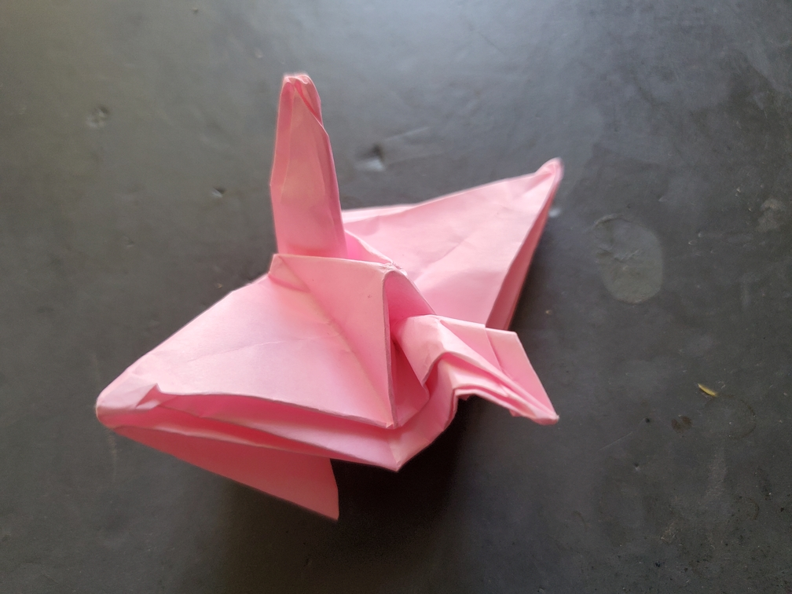

    <figure>
        
    </figure>
    <figure>
          
    </figure>

*The **small thick fat crane** has some trouble flying, given its thick body compared to its size. It can win a contest against a paper airplane, though.*

So, funny story. After the disaster that was the [wrinkly floor crane](../0042/), I decided to try to improve it. The first thing is that you don't actually need to extract
a whole square from the paper, because in the crane, the edges of the square meet up at each other. Thus, you don't need the triangular backside lakes. In the process of
using this fact, I folded a test model that's just the inner part, without the transition to the outer pleats. And this is what happened. It was small. It was thick. It was fat
(because I didn't thin it).