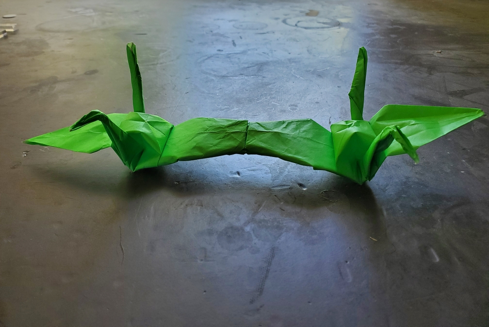

    <figure>
        
        <figcaption>#44: Left Twin Crane / ヒダリフタゴヅル</figcaption>
        <figcaption>#45: Right Twin Crane / ミギフタゴヅル</figcaption>
    </figure>
    <figure>
          
        <figcaption>This came from a square, with corners folded in.</figcaption>
    </figure>

*The **left twin crane** flies in a side-by-side formation with its twin, the right twin crane. They say there's strength in numbers. Does that apply to flying strength too?*

*The **right twin crane** flies in a side-by-side formation with its twin, the left twin crane. They say there's strength in numbers. Does that apply to flying strength too?*

I used a bit of ERM and some non-axial 22.5° to make this model. I forgot whether it had a nice folding sequence, however. This used 35cm kami. 35cm was fine, but using kami
was a mistake because of how *thick* the connection point ended up being. So many layers.