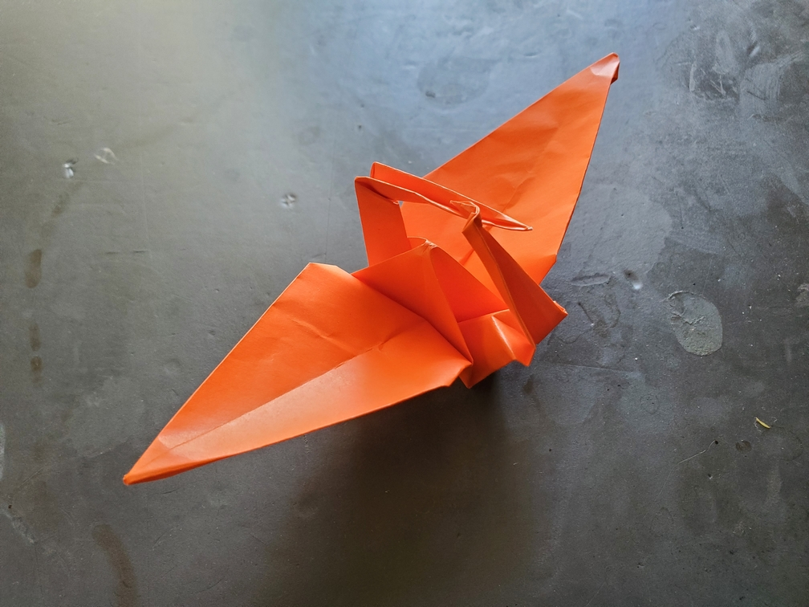

    <figure>
        
    </figure>

*The **cycle crane** flies in circles, chasing its own tail. Will there be an end?*

Just some posing done at the end to make the head and tail form a cycle. I thought it was an interesting idea.