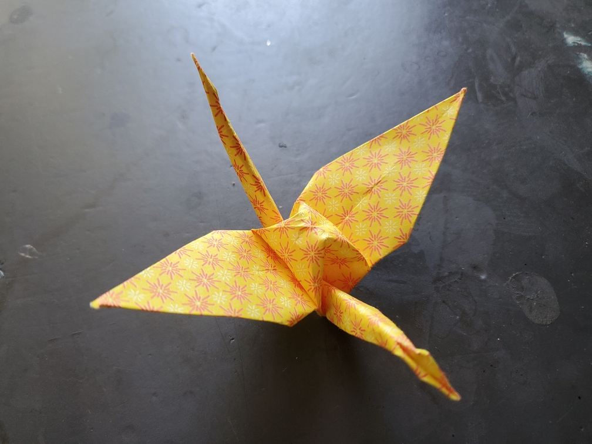

    <figure>
        
    </figure>

*The **patterned crane** flies elegantly, showing off its beautiful pattern as it soars through the skies. It distracts onlookers all over.*

I got some chiyogami, so it was time to use it to fold a crane. From what I remember, the texture felt different in a nice way. And the pattern is pretty too.