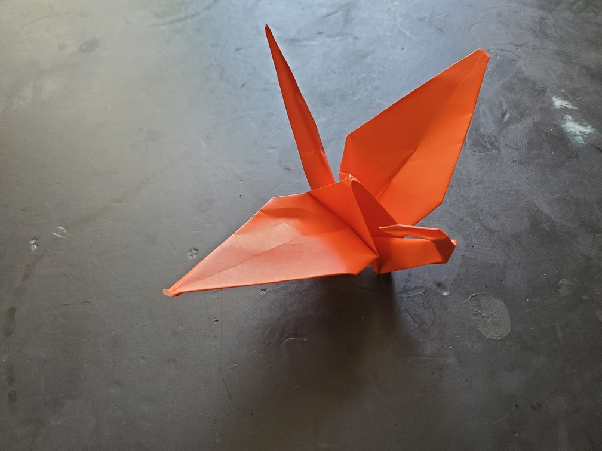

    <figure>
        
    </figure>

*The **look-behind crane** isn't pessimistic[^pess], it just likes checking its back to avoid surprises from behind. However, in front...*

Usually, a crane is folded to look forward, but this time I decided to try something different and fold its head around so that it's looking backward.

[^pess]: based on a pun on the Japanese phrase 後ろ向き (looking behind, pessimistic)