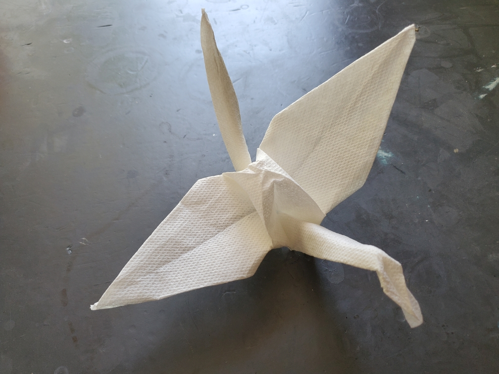

    <figure>
        
    </figure>

*The **paper towel crane** makes sure to shelter in the rain, as its whole body is easily rendered weak by water.*

I took a square paper towel and folded it into a crane. This material is somewhere between paper and fabric, and it likes to, umm, behave like fabric a little[^fabric]. And
the creases are tricky to reverse. But it does hold creases! And the result was better than expected.

[^fabric]: ヒラヒラする. To my embarrassment at the time of writing I couldn't find a good way to describe it in English.