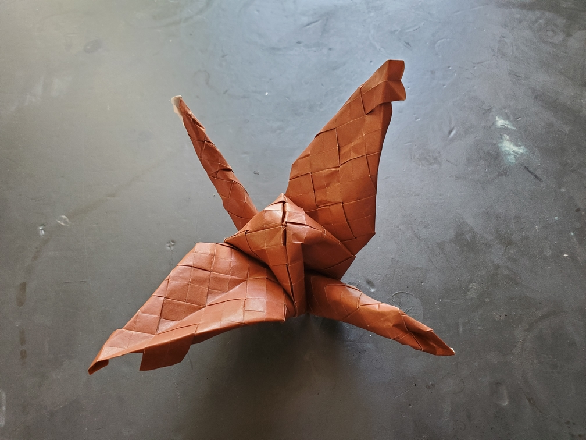

    <figure>
        
    </figure>

*The **plain weave crane** flies in the skies, with the wind breezing over its woven patterned skin.*

For this one, I used 35cm paper and made a 12×12 grid with a closed plain weave pattern (more weave info in my [(2, 2)-twill model](/origami/models/2-2-aya-ori/)).
Thats 121 complete closed square twists, since each vertex of the grid contains a square twist. You can bet I got good at square twists during this model, even without
precreasing the diagonals. One trick is to fold the twist on the back side, because there you have folds that you can grab and pull on to complete the twist elegantly.
After completing the weave, I turned the result into a crane. The paper felt a little bit like leather, and that and the color reminded me of (American) football.

Unfortunately the weave is a little hard to see in the end. If there's a next time, I'll be using an open weave pattern instead.