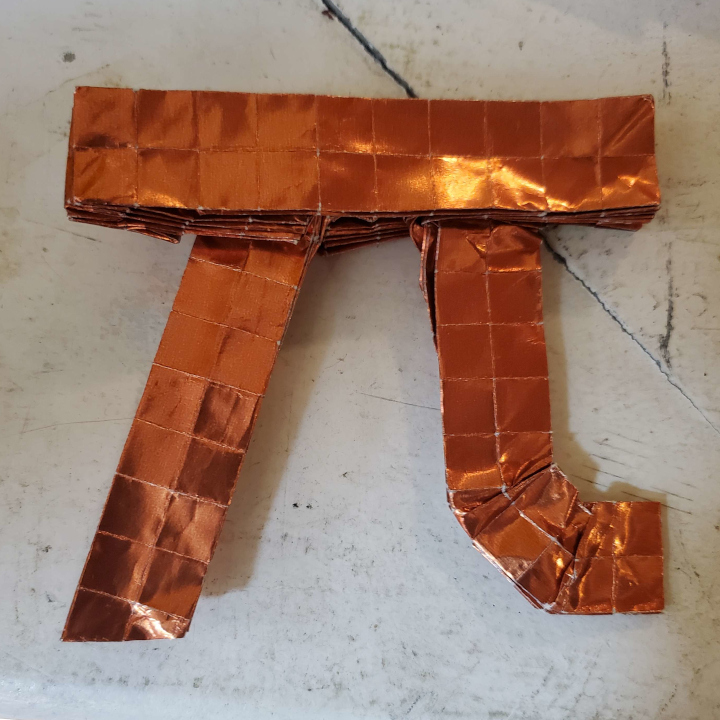
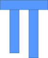

    <figure>
        
    </figure>
    <figure>
          
        <figcaption>(before shaping)</figcaption>
    </figure>

This is another model developed using the [edge river method](https://origami.abstreamace.com/2021/12/12/geography-of-origami-a-brief-introduction-to-the-edge-river-method/)
(though this one was developed with an extension I call the 2-color edge river method, which uses different colors for horizontal and vertical rivers, and was helpful
for internalizing the rules for how rivers are allowed to interact with each other.)

There was some shaping involved, which was not included in the abstraction.

    <figure>
        
        <figcaption>The abstraction for π without shaping</figcaption>
    </figure>

